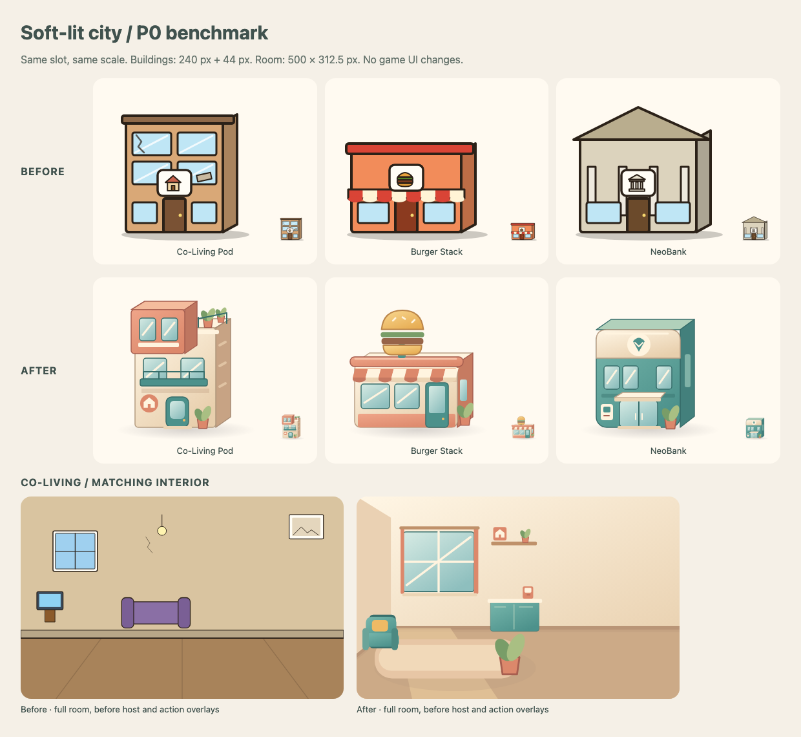

# P0 soft-lit city benchmark — review candidate

Three exterior overrides (Co-Living Pod, Burger Stack, NeoBank Branch) and the Co-Living
interior. `modern` v0.1.0 extends `default`; the other 193 slots, board, UI theme, labels,
avatar recolouring and game rules are inherited unchanged. Based on main
`c3e8d80ac12a705a6e3e7be62df7960d22dc0e4b`. Existing art PRs #20, #21 and graphics proposal
in #33 were inspected; no open art PR or existing modern set was found.

## Install and compare

Download [modern-benchmark.zip](modern-benchmark.zip). In the game, open Settings → Art
packs → import the zip. Start **Modern Western** to see the intended location names.
Select Default in Settings to compare. Import persists on this browser/device only.
This is an installable pack using the existing supported loader, not a default-art rollout.

Regenerate with `pnpm art:modern`, verify with `pnpm art:modern --check` and
`pnpm art:check`. Packaging instructions are in [the artist guide](../../README.md).
The generator shares primitive SVG helpers with `tools/art-default`, but does not change
the default generator or any default file. No raster, text, external URL, new font, new
runtime dependency, theme override or application-code change is included.

## Visual evidence

| View                                           | Before                                | After                               |
| ---------------------------------------------- | ------------------------------------- | ----------------------------------- |
| Desktop board (1440 × 900 viewport, full page) | [before](desktop-before-board.png)    | [after](desktop-after-board.png)    |
| Desktop room (same viewport)                   | [before](desktop-before-interior.png) | [after](desktop-after-interior.png) |
| Phone board (390 × 844 viewport, full page)    | [before](phone-before-board.png)      | [after](phone-after-board.png)      |
| Phone room (same viewport)                     | [before](phone-before-interior.png)   | [after](phone-after-interior.png)   |

Captured from Chromium with the real Settings importer and seeded game
`art-benchmark-p0`, not from a mock UI. Full-page captures exceed the viewport height
because the existing page scrolls. Contact-sheet room art is shown before overlays.
Screenshots are produced in `reports/art-benchmark` by `art-benchmark.spec.ts` and copied
here after inspection; reruns do not rewrite approved review attachments automatically.

Inspected the actual rendered contact sheet, desktop board and room, and phone board and
room. All four new assets render. Exteriors sit inside their slots with no cut-off roofs,
plants or shadows and remain clear of the HTML label plates. At 44px, the pod's stepped
silhouette, burger roof sign and teal bank mass read distinctly; fine ATM/window details
are decorative. Full bank identity still relies on its NeoBank label, as intended.

The interior leaves the action panel calm and the inherited host unobstructed. On phones,
the existing header intentionally crops the full room: the window, kitchenette, host and
speech stay visible, while some peripheral floor/plant detail is cropped. The default host
has a heavier outline than the room; replacing hosts is outside this benchmark.

## Validation

Final checks (2026-09-30):

| Command                                                                                      | Result                                                                                                |
| -------------------------------------------------------------------------------------------- | ----------------------------------------------------------------------------------------------------- |
| `pnpm lint`                                                                                  | Pass: ESLint and Prettier                                                                             |
| `pnpm typecheck`                                                                             | Pass                                                                                                  |
| `pnpm art:modern --check`                                                                    | All four committed SVGs match generator                                                               |
| `pnpm art:check --report`                                                                    | Pass: default 197, modern 4 assets                                                                    |
| `pnpm art:preview --set modern`                                                              | 4 drawn, 193 inherited, 0 missing                                                                     |
| `pnpm test`                                                                                  | 106 files passed; 934 tests passed, 10 existing todos; coverage passed; all 3 content packs validated |
| `pnpm check:banned`                                                                          | 31 terms, 0 hits                                                                                      |
| `pnpm build`                                                                                 | Pass; initial gzip 229.1/350 KB; bundled art 576.9/1536 KB                                            |
| `pnpm exec playwright test art-benchmark.spec.ts --workers=3`                                | Final delivered-zip rerun: 7 passed, 2 duplicate contact sheets skipped                               |
| `pnpm exec playwright test art-benchmark.spec.ts artpacks.spec.ts scene.spec.ts --workers=3` | 17 passed, 4 viewport-specific/duplicate cases skipped across desktop/tablet/phone                    |

The four source SVGs total 17,602 bytes (largest 4,892); the delivered zip is 5,508
bytes. The build budget measures the unchanged bundled default art; the modern pack is
imported separately. Browser tests import the delivered zip and compare its rendered SVG
contents to source, preventing stale packaging. They also assert 44px minimum phone targets.

`pnpm verify`, the entire e2e suite, and `sim:gate` were not run. No simulation, game rule,
content, engine, or default art changes are proposed. The production build retains the
existing Vite large-chunk advisory while staying within the enforced budget.

Environment: bundled Node 24.19.0 and pnpm 11.19.0, macOS Chromium. The repository requests
pnpm 9.15.9; no lockfile or workspace dependency changes were retained. Initial sandboxed
`tsx` commands failed to create IPC sockets; final normal scripts passed outside the sandbox.
The locked install populated dependencies but returned an ignored-build-scripts advisory
from pnpm 11; no dependency policy was changed. Subsequent compile/test/build checks passed.

Tests exercise actual zip
import, import persistence after reload, every overridden slot, inherited avatar tint,
accessible location names and travel to the bank. Whole-interior and board-only axe
checks run for both old and new sets.

A whole-page axe check **outside** the home initially failed for both Default and Modern:
`scrollable-region-focusable` on `LocationPanel.tsx`'s `.scroll-shadow` action list when
all its actions are disabled. This predates the art change. The benchmark audits the map
controls separately, with no disabled rule or app workaround. It does not claim the
entire outside page passes axe. A separate UI task should add keyboard access to that
scrollable region; this PR does not broaden into that fix.

## Review gate and next task

Art director: review the three silhouettes, strength of the tonal outlines at phone size,
the bank pictogram, and the room/host contrast. Approve or request changes to the
[candidate style](../../STYLE.md#p0-benchmark--candidate-v01-awaiting-art-director-review).
Do not start a whole-city rollout until this benchmark and style are approved. If approved,
the next production brief can cover the remaining exterior set and board as a separate task.
