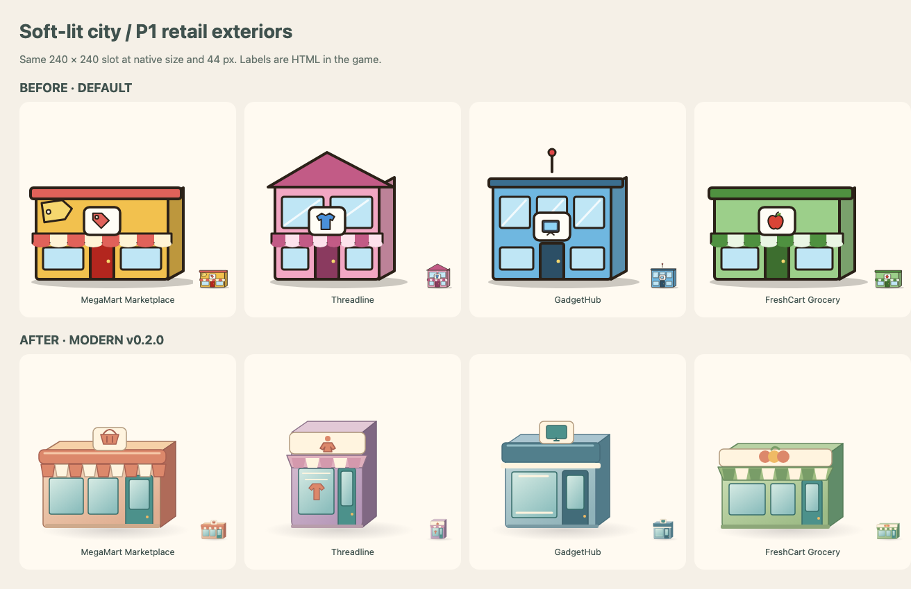

# P1 retail exteriors — Modern v0.2.0

Four new 240 × 240 soft-lit vector storefronts extend the approved October 1 daytime direction. The cumulative pack has seven buildings and the P0 Co-Living interior; 189 of 197 slots inherit Default. Labels remain in HTML. No default-art selection or runtime code changed.

| Slot                         | Modern Western label | Visual identity                                            |
| ---------------------------- | -------------------- | ---------------------------------------------------------- |
| `building:discount-store`    | MegaMart Marketplace | Wide low coral storefront, striped awning, basket roof cue |
| `building:clothing-boutique` | Threadline           | Narrow mauve facade, garment display and roof pictogram    |
| `building:electronics-store` | GadgetHub            | Compact blue-gray shop, screen roof cue and broad glass    |
| `building:grocery`           | FreshCart Grocery    | Low green facade, striped awning and produce cluster       |

Download [modern-retail-v0.2.0.zip](modern-retail-v0.2.0.zip), then use Settings → Art packs → import. Select Modern Western in New Game for the labels. Reimporting the same pack updates its stored copy; the choice remains local to each browser/device.

| Game view     | Default                            | Modern v0.2.0                    |
| ------------- | ---------------------------------- | -------------------------------- |
| Desktop board | [before](desktop-before-board.png) | [after](desktop-after-board.png) |
| Phone board   | [before](phone-before-board.png)   | [after](phone-after-board.png)   |

The P0 benchmark files, zip and screenshots are historical evidence and remain unchanged. This batch adds no board, interior, host, avatar, theme, animation, UI or gameplay changes. The previously reported outside-home action-list keyboard-focus issue remains a separate UI follow-up. CI currently omits the full `art:check` command, so it is run explicitly for this batch.

## Validation record

The generator, art validator, banned-terms check, lint, typecheck, build and targeted archive/import browser tests are run for this batch. The archive test compares all nine file entries (manifest plus eight SVGs) byte for byte with source. Browser tests exercise reimport, reload persistence, the four retail keys, inherited fallback and avatar tint at desktop and phone sizes. Current-head CI must be checked on the published draft PR before completion.
