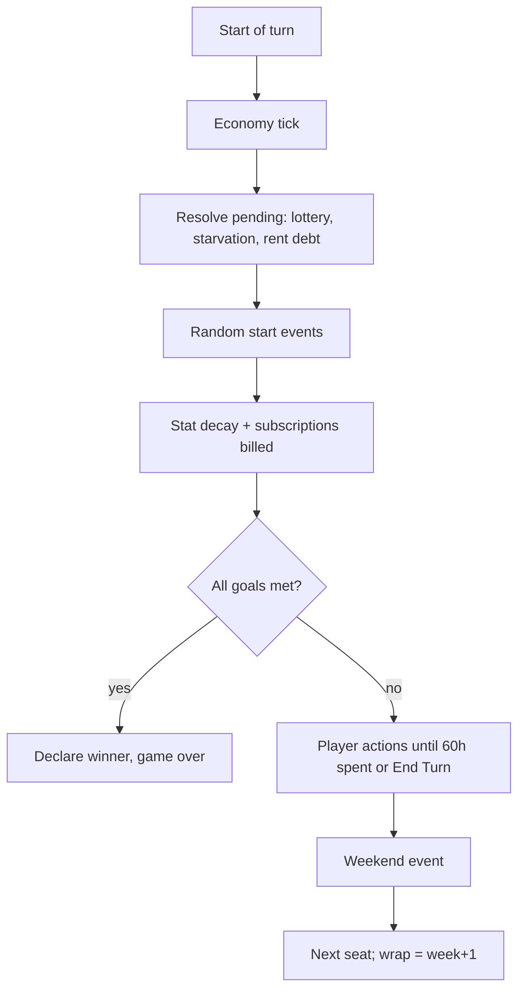

# 4. docs/GDD.md — game rules (authoritative)

Rules apply to both rulesets unless marked **[modern]** (only when the ruleset's feature flag is on). All numbers are defaults stored in CityPack `rules.json`; engine reads them, never hardcodes them. Currency unit shown as `$` in both v1 packs.

## 4.1 Game setup

1. Choose ruleset: `classic` or `modern-western` (default).
2. Seats 1–4. Each seat: type Human | AI; AI difficulty Easy | Normal | Hard; AI personality (see 4.14); name (≤ 16 chars); color from color-blind-safe palette; token shape (circle, square, triangle, diamond).
3. Goals per human seat: Wealth, Happiness, Education, Career sliders 10–100 step 10, default 50. AI seats: each goal random uniform from {30..80 step 10} (Easy uses {20..60}, Hard {50..100}).
4. Options: seed (auto from `crypto.getRandomValues` in UI layer, editable), Chaos level Off | Classic | Modern | Chaotic (default Classic for classic ruleset, Modern for modern), Classic opacity on/off, AI animation speed Instant | Fast | Normal.
5. Single seat total → game auto-adds 1 AI seat (Normal, random personality) unless user explicitly sets "Solo practice" (no opponent).
6. Starting state per player: cash $200, bank $0, low-tier home, no job, casual clothing 4 weeks, 0 food, dependability 20, experience 10, relaxation 10, happiness 10, wellbeing 70 [modern], location = home square, week 1.

## 4.2 Turn structure

- Order of start-of-turn steps is fixed exactly as above and MUST be covered by an ordered test.
- Economy tick runs once per week, on the first seat's turn only (not per player) so all players see identical prices within a week.
- Win check uses stats after steps B–E. Ties impossible in sequential mode (first to check wins).
- `End Turn` command allowed any time; unspent hours are lost.
- Hour clock: `hoursLeft` starts at 60 minus penalties (starvation, sickness). Actions requiring N hours with fewer left: work pro-rates pay; study/relax refused; travel moves as far as time allows then turn ends.

## 4.3 Board and movement

- Ring of 16 squares; location IDs and order from `board.json`. Distance = min(clockwise, counter-clockwise) steps; player picks direction automatically by shortest path.
- Entering a location costs `enterHours` = 2.
- Travel cost per mode (modern). Classic has walk only.

| Mode | Hours per step | Money | Unlock | Wellbeing | Events |
| --- | --- | --- | --- | --- | --- |
| Walk | 0.625 | $0 | Always | +1 per trip ≥ 4 steps | Street theft exposure at bank/grocery |
| Transit | 0.35 + 1 fixed wait | Weekly pass $25×econ or $3/trip | Buy pass at City Services | 0 | Delay event (+2h) 5% |
| Ride-hail | 0.2 | $4 + $1.5/step × econ × surge | Own smartphone | 0 | Surge ×1.5–×3 10%; driver no-show +1h 3% |
| Car | 0.15 | Weekly upkeep $40×econ (fuel, insurance, parking) | Own car | −1 per trip in "traffic" event | Breakdown 2%/trip (used 5%) |

- Hour costs are rounded up to 0.5. Minimum trip cost 0.5h.
- Mode selector shows each mode's hours and money before confirm; unavailable modes are shown disabled with reason.
- Car ownership: used car at Resale Kiosk ($2,500–$4,500 × econ), new car at MegaMart ($12,000 × econ, requires loan unless paid cash). Car can be sold at Resale Kiosk for 50% (used) / 60% (new, first 26 weeks) of current value; value depreciates 1%/week.

## 4.4 Goals

| Goal | Formula (clamped 0–100) |
| --- | --- |
| Wealth | `floor((cash + bank + marketValue(investments) − loanPrincipalOutstanding) / 100)`; items excluded [modern subtracts loans; classic has no loans] |
| Education | `1 + 9 × degrees` |
| Career | `floor(dependability × 1.25)` if employed in a non-gig job, else 0 |
| Happiness | Stored stat, changed per 4.9 table |

Wealth goal scale is per CityPack (`wealthPointValue`, default 100). Goal met when stat ≥ target at win check.

## 4.5 Wellbeing [modern]

Wellbeing is a 0–100 survival stat, not a goal.

| Trigger | Delta |
| --- | --- |
| Each 6h work session | −3 (gig −4) |
| Each 6h study session | −2 (online at home −1) |
| Relax at home (6h) | +8 (+2 per comfort durable, max +16) |
| Week with ≥ 12 unspent hours | +5 |
| Walk trip ≥ 4 steps | +1 |
| Starvation | −10 |
| Gym subscription active | +2/week |
| Streaming subscription active | +1/week |
| Loan payment missed | −5 |
| Weekly natural drift | toward 60 by 2 |

| Band | Effect at start of turn |
| --- | --- |
| ≥ 70 | +1 Happiness |
| 25–69 | None |
| 10–24 | "Burnt out": −10 hours this turn, work pay −10%, study lesson 20% chance wasted |
| < 10 | "Collapse": forced rest, player loses entire turn (only zero-hour actions), wellbeing set to 40, dependability −10, 25% job loss chance if employed |

## 4.6 Jobs

- Apply at JobLink Center: 4h. Qualified if experience ≥ req, dependability ≥ req, all required degrees held. Uniform not needed to be hired but needed to work.
- Luck roll (classic formula, 3.4). Fail → "No openings", job locked for this player's turn.
- Hired: +3 Happiness; dependability := max(dep, 10); maxDependability and maxExperience recomputed; wage = listed wage × econ at hire time (locked until raise or change).
- Raise: 4h at JobLink; requires dep > req + 5 × raisesThisJob; wage := current listed wage if higher; +3 Happiness.
- Work (at workplace): 6h → pay `8 × wage`, pro-rated by hours; +1 experience (to max); +dependability `+2` (to max) [ASSUMED]; requires uniform tier ≥ job tier else refused.
- Firing: if dependability < job req − 10 at work attempt → fired (−5 Happiness).
- Garnish: if rent debt, 50% of pay + $2 goes to debt.
- **[modern] Titles:** modern names per ladder (e.g. Fulfillment Center: Picker → Forklift Operator → Shift Supervisor → Operations Engineer → Site General Manager). Content defines 10 workplaces × 3–7 jobs (SEED_DATA 14.1) mirroring classic table requirements exactly, only names/flavor differ.
- **[modern] Gig jobs** (sign up at JobLink, 1h, no roll): Delivery Rider (needs smartphone; walk/transit uses $0 bike), Ride-hail Driver (needs smartphone + car). Work anywhere on the board via `Gig Shift` command in 3h or 6h blocks. Pay = base × econ × demand multiplier (weekly random 0.6–1.6). No experience, no dependability, career stat 0 while gig is the only job. A player MAY hold one regular job and one gig simultaneously; career stat uses the regular job. Gig shift wellbeing −4/6h; driver adds car wear (breakdown chance +1%).

## 4.7 Education

- Degree tree per 3.5; modern names: Vocational Certificate (Trade School), Associate Degree (Junior College), Electronics & IoT, Pre-Engineering, Software Engineering (Engineering), Business Administration, Liberal Arts BA (Academic), Master's, PhD, Research Fellowship (Research), Published Author (Publishing).
- Enroll (0h, fee $50 × econ per course), up to 4 concurrent. Lesson = 6h at university; graduation at 10 lessons (− extra credit, min 8): +5 Happiness, +5 Dependability, education stat recomputed, maxDep/maxExp recomputed.
- **[modern] Online study:** requires owned laptop AND active Home Internet subscription AND being at own home. Lesson 6h, counts identically, wellbeing −1 instead of −2, 15% chance "doomscrolled" → lesson not counted, 6h still spent. Owning a Focus App subscription reduces waste chance to 5%.
- Extra credit items (modern): e-reader, reference software bundle, noise-cancelling headphones; each −1 lesson, cap −2.

## 4.8 Stat decay (start of turn, step E)

- Dependability −3 (min 0). Relaxation −1 (min 10; none with hot tub/massage chair). Clothing weeks −1 per owned outfit in use; 0 → downgrade uniform tier.
- Food: if fridge food ≥ 1 consume 1; else if fast-food meal bought last turn consume it; else starvation (−20h this turn, −5 Happiness, wellbeing −10 [modern]). **[modern]** A delivery meal bought last turn counts as fast food.
- Spoilage: fresh food held without fridge spoils at turn start → doctor event.
- **[modern] Subscriptions billed** from bank, then cash; unpaid → auto-cancel + −2 Happiness.

## 4.9 Happiness table

| Source | Delta |
| --- | --- |
| Hired / raise | +3 |
| Application refused | −1 |
| Fired / laid off | −5 |
| Graduation | +5 |
| Relax at home (first per turn) | +2 + 1 per comfort durable (max +6) |
| Buy durable (first of type) | item `happinessOnBuy` (1–6) |
| Tickets / junk items | item value (−3..+4) |
| Burglary / theft | −4 |
| Starvation | −5 |
| Move to secure housing | +5 once |
| Weekend event | event value |
| Wellbeing ≥ 70 [modern] | +1/turn |
| Viral event [modern] | +8 |

Happiness clamps 0–100. Starts at 10.

## 4.10 Housing and rent

- Tiers: low (Co-living Pod) and high (Guarded Tower Condo). Baseline rent $325 / $475 × econ; locked at move-in. Rent due every 4th week; pay at City Services (0h) any time in advance for N months.
- Rent not paid by end of due week → rent debt; extension request (1h, 60% approve) pushes deadline 1 week; any past debt → extensions always denied.
- Rent debt → garnish 50% + $2 of work pay; eviction after 8 weeks of debt: moved to low tier, durables >2 lost.
- Low tier burglary at turn start: `p = clamp(0.02 + 0.01 × durablesOwned − 0.0008 × relaxation, 0.005, 0.15)`; steals 1–all durables.
- **[modern] Rent hikes:** on each rent renewal (week 4k) with probability 0.25 × chaos multiplier, locked rent rises 5–15%; high tier has 0.10. Notice shown one week ahead via news feed.
- **[modern] Co-living quirks:** roommate borrows food event (−1 fridge unit, 5%/week).

## 4.11 Food, clothing, items, subscriptions

- Fast food meal at Burger Stack: $6–$12 × econ, 0h beyond entry. **[modern] Delivery:** with smartphone, `Order Delivery` command anywhere, 0.5h, price = meal × 2.2, 5% "order lost" (money refunded 50%, no meal).
- Groceries at FreshCart: 1/2/4 units, $15/unit × econ; fridge cap 6, fridge+freezer 12.
- Clothing tiers at Threadline: casual $60 (8 weeks), dress $150 (10 weeks), business $300 (12 weeks); MegaMart versions 50% price, 60% duration.
- Items MUST be content-defined with fields: id, category, price, storeIds, happinessOnBuy, comfort (bool), extraCredit (bool), breakdownPerWeek, repairCost, resaleFactor, unlocks (e.g. `rideHail`, `onlineStudy`, `delivery`, `gigDelivery`).
- Required modern items: smartphone, laptop, tablet, smart TV, game console, e-reader, noise-cancelling headphones, fridge, freezer, air-fryer, robot vacuum, massage chair (hot-tub equivalent), bike, phone case/insurance, gym membership card (links gym sub).
- **[modern] Subscriptions** (start/cancel at GadgetHub, except Gym at City Services and Food Club at Burger Stack): Home Internet $15, Streaming $12, Music $8, Cloud Storage $3, Gym $25, Focus App $5, Food Club (delivery fee −30%) $9. Each has weekly price, happiness or wellbeing effect, and `priceDrift`: every 8 weeks 30% chance +10–20%. Weekly total shown in HUD. Cancel requires visiting the location where started (satire: "retention offer" dialog with one extra confirm).

## 4.12 Economy, investments, loans

- Economy index `econ` ∈ [0.5, 1.6], start 1.0. Weekly update: `econ = clamp(econ × (1 + drift + noise))`, phase Boom (drift +0.004), Stable (0), Recession (−0.006); noise N(0, 0.012); phase transition each week with p = 0.04 per adjacent phase. Crash event (see 4.13) multiplies econ by 0.75–0.9.
- Prices, rents, wages at hire, fees scale by `econ`. Existing wages and locked rents do not auto-change.
- News feed at FreshCart (classic: newspaper $1; modern: free with smartphone anywhere) shows next-week phase hint with 70% accuracy.
- Investments at bank (0h inside). Classic: T-Bills, Gold, Silver, Commodities, Blue Chip, Penny Stocks, each bounded random walk. **[modern]:**

| Asset | Weekly drift | Volatility | Econ correlation | Special |
| --- | --- | --- | --- | --- |
| Savings | +0.05% | 0 | 0 | Always safe |
| Bonds | +0.12% | 0.3% | −0.2 | — |
| Index ETF | +0.15% | 2% | +0.7 | — |
| Tech Stock | +0.2% | 5% | +0.8 | AI-boom event +20% |
| Crypto | +0.1% | 12% | +0.4 | Rug-pull event −60–90%, 0.8%/week |
| Gold | +0.08% | 1.5% | −0.5 | Crash event +10% |

- Buy/sell in whole dollars, 1% fee (crypto 2%). Prices start at 100. Correlated returns computed from shared econ shock + idiosyncratic noise (seeded).
- **[modern] Loans** at NeoBank: principal $500–$15,000; approval if `weeklyIncomeEstimate × 52 × 0.4 ≥ principal` or car collateral; APR = 6% + 4% × (econ − 1) + 8% if dependability < 30; weekly payment amortized over 52 or 104 weeks, auto-debited at turn start. Missed payment: +$25 fee, wellbeing −5; 4 missed → default: collateral repossessed, pay garnished 30% until cleared. Early repayment allowed, no penalty.

## 4.13 Events

Events are content-defined: `{id, family, trigger: 'turnStart'|'weekend'|'onEnter:<loc>'|'onAction:<cmd>', conditions (JSON-logic), baseWeight, chaosWeights {off,classic,modern,chaotic}, effects[], textKey}`. At most 1 start-of-turn random event per player per turn, plus 1 weekend event. Chaos multipliers: Off 0 (weekend still runs, neutral only), Classic 1, Modern 1.3, Chaotic 2.

| Family | Examples (effects) | Ruleset |
| --- | --- | --- |
| Classic: theft | Street thief at bank/grocery exit steals cash (p 3% if cash > $200) | both |
| Classic: burglary | Low-tier home durables stolen | both |
| Classic: breakdown | Appliance broken, repair cost | both |
| Classic: economy | Boom news, recession, market crash (job-loss chance 10–100% by severity) | both |
| Classic: weekend | Cheap weekend −$20–$200; with computer earn +$50–$150 | both |
| Classic: lottery | Resolve tickets: prizes $200–$5,000 | both |
| Classic: doctor | Sick: −10h, $30–$60 | both |
| AI layoffs | Job automated: fired if job has `automationRisk` ≥ roll; severance 2 weeks wage; next course enrollment free | modern |
| Going viral | +8 Happiness, +$100–$1,000 if smartphone; 30% chance backlash next week −3 | modern |
| Scams & phishing | Lose 5–30% bank; chance × (1 − 0.08 × degrees), ×0.5 if Cloud Storage/2FA item | modern |
| Gadget breakdown | Cracked screen/battery: smartphone or laptop disabled until repaired; phone case halves chance | modern |
| Rent hike / surge / delivery lost / transit delay | Per 4.3, 4.10, 4.11 | modern |

`automationRisk` per job in content: entry clerical and warehouse jobs 0.3–0.5, trades 0.1, management/teaching 0.05. Base layoff weight 1.5%/week for employed players.

## 4.14 AI rival (behavioral spec)

- Uses only public state + own private state. Plans each turn by beam search (width W, depth D) over command sequences within remaining hours; stops when plan exhausts hours or no positive-utility action.
- Utility = Σ goal weights × normalized goal gap closed + wellbeing term + risk term − cost of time; weights from personality.

| Difficulty | W × D | Score noise | Lookahead weeks | Investing |
| --- | --- | --- | --- | --- |
| Easy | 3 × 3 | σ = 0.35 | 0 | Savings only |
| Normal | 6 × 5 | σ = 0.1 | 2 | ETF/bonds |
| Hard | 12 × 8 | 0 | 6 | All assets, econ-phase aware |

| Personality | Traits |
| --- | --- |
| Grinder | Career/wealth weight ×1.4, low relax, walks |
| Scholar | Education weight ×1.6, online study |
| Hustler | Gig + ride-hail, crypto risk tolerance high |
| Balanced | Equal weights, keeps wellbeing ≥ 50 |

- AI MUST finish its turn within 250 ms on Normal and 1,000 ms on Hard (median, desktop) — enforced by benchmark test.
- AI actions are recorded as normal commands; UI replays them with animation per speed setting.

## 4.15 Commands (complete list)

`Move{to, mode}`, `Enter{loc}`, `Exit`, `ApplyJob{jobId}`, `AskRaise`, `Work{hours}`, `GigSignup{gigId}`, `GigShift{hours}`, `Enroll{degreeId}`, `Study{degreeId}`, `Relax`, `BuyItem{itemId, qty}`, `SellItem{itemId}`, `RedeemPawn{itemId}`, `BuyFood{units}`, `EatMeal{mealId}`, `OrderDelivery{mealId}`, `PayRent{months}`, `RequestExtension`, `MoveHome{tier}`, `Deposit{amount}`, `Withdraw{amount}`, `BuyAsset{assetId, amount}`, `SellAsset{assetId, amount}`, `TakeLoan{principal, termWeeks, collateral?}`, `RepayLoan{amount}`, `Subscribe{subId}`, `Unsubscribe{subId}`, `BuyTransitPass`, `BuyCar{source, financed}`, `SellCar`, `Repair{itemId}`, `BuyLottery{qty}`, `ReadNews`, `TravelCity{to}` (disabled unless the world has >1 city), `EndTurn`. Every command has: validation rules, hour cost, money cost, effects, emitted domain events — CC MUST implement a validator per command returning typed error codes (e.g. `ERR_NOT_ENOUGH_HOURS`, `ERR_NOT_AT_LOCATION`, `ERR_UNIFORM_REQUIRED`).

## 4.16 Game end

Winner declared at win check; remaining seats do not take turns. End screen: winner, weeks elapsed, per-player goal chart over time, key stats (total earned, degrees, highest job, net worth, events suffered), buttons: Rematch (same seats, new seed), New Game, Export Replay. Engine `score(state, seat)` (16.7) is computed and submitted to `LeaderboardService`.
