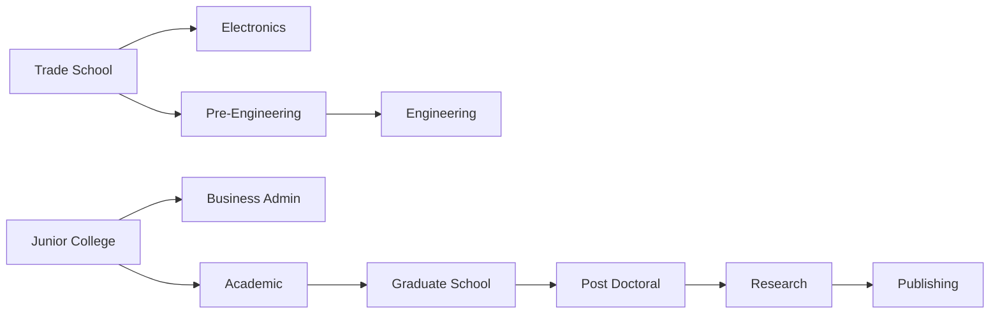

# 3. docs/ORIGINAL_REFERENCE.md — 1991 baseline

This section is the ground truth for the `classic` ruleset. Tags: **[SRC]** = documented by a cited source; **[ASSUMED]** = not publicly documented, value chosen by spec author, CC MAY tune it during stage-1 calibration and MUST log changes in `DECISIONS.md`. CC MUST NOT research the web during the build. Original names appear here only for traceability; they are banned everywhere else. Research note: fan-wiki pages were read via search-indexed excerpts (direct page fetch was blocked), so treat [SRC] numbers as high-confidence but cross-check against internal consistency in tests.

## 3.1 Turn and time

- [SRC] Each turn = 1 week of 60 Hours (time points). Moving and actions spend Hours. ([Time](https://jonesinthefastlane.fandom.com/wiki/Time))
- [SRC] Turn ends when a player leaves a location or is travelling with 0 Hours left; inside a location, zero-time actions (buy, deposit) remain allowed. ([Turn](https://jonesinthefastlane.fandom.com/wiki/Turn))
- [SRC] One full lap of the board ≈ 10 Hours; entering any location costs 2 Hours; turns start at the player's apartment. ([Locations](https://jonesinthefastlane.fandom.com/wiki/Locations))
- [SRC] Movement allowed in either direction around the ring. ([Wikipedia](https://en.wikipedia.org/wiki/Jones_in_the_Fast_Lane))
- [SRC] Economy adjusts at the start of each turn; lottery resolves at turn start. ([Turn](https://jonesinthefastlane.fandom.com/wiki/Turn))
- [SRC] A weekend event occurs each week, usually costing under $200 (or earning money if the player owns a computer). ([Wikipedia](https://en.wikipedia.org/wiki/Jones_in_the_Fast_Lane))
- [ASSUMED] Board has 16 squares; 1 lap = 10 Hours → 0.625 Hours per square, rounded to per-move cost `ceil(squares × 0.625)`.

## 3.2 Goals and win

| Goal | Stat formula | Notes |
| --- | --- | --- |
| Wealth | `floor(liquidAssets / 100)`; liquid = cash + bank + stocks; items ignored | [SRC] $10,000 = 100 ([Wealth Goal](https://jonesinthefastlane.fandom.com/wiki/Wealth_Goal)) |
| Education | `1 + 9 × degreeCount`; 11 degrees → 100 | [SRC] never decreases ([Education Goal](https://jonesinthefastlane.fandom.com/wiki/Education_Goal)) |
| Career | `dependability × 1.25`, 0 if unemployed; can drop | [SRC] 80 dependability = 100 ([Career Goal](https://jonesinthefastlane.fandom.com/wiki/Career_Goal), [Dependibility](https://jonesinthefastlane.fandom.com/wiki/Dependibility)) |
| Happiness | Running stat changed by actions, items, events | [SRC] mechanism; [ASSUMED] starts at 10, clamp 0–100 ([Stat](https://jonesinthefastlane.fandom.com/wiki/Stat)) |

- [SRC] Goals set per player at start, each 10–100; AI rival goals random; first to meet all four wins. ([Goals](https://jonesinthefastlane.fandom.com/wiki/Goals))
- [SRC] Win check occurs at the start of the player's turn. ([Wealth Goal](https://jonesinthefastlane.fandom.com/wiki/Wealth_Goal))
- [ASSUMED] Slider step = 10; default 50 each.

## 3.3 Hidden stats

| Stat | Start | Rules | Tag |
| --- | --- | --- | --- |
| Dependability | 20 | −3 per week, min 0; reset to 10 on new job if below 10; +5 per degree (may exceed max); max = `20 + jobRequiredDep + 5 × degrees` | [SRC] |
| Experience | 10 | +1 per work session; never decreases; capped by job/degree-based max | [SRC] ([Experience](https://jonesinthefastlane.fandom.com/wiki/Experience)); [ASSUMED] max = `20 + jobRequiredExp + 5 × degrees` |
| Relaxation | 10 | Relax at home: 6 Hours, +3, max 50; −1 per turn (none if hot tub owned); min 10; high value reduces doctor visits and burglary | [SRC] ([Relaxation](https://jonesinthefastlane.fandom.com/wiki/Relaxation)) |

## 3.4 Jobs and employment

- [SRC] Apply at employment office: 4 Hours; requires experience, dependability, and all listed degrees; success gives +3 Happiness; refusal −1 Happiness. ([Employment Office](https://jonesinthefastlane.fandom.com/wiki/Employment_Office))
- [SRC] Luck roll when qualified: `luck = 30 + (10 + dependability + experience + 8 × degrees) / 3`; roll d100; fail = "no openings", job locked for rest of turn. Entry fast-food cook always approved.
- [SRC] Raise: requires dependability above job requirement; +3 Happiness; requirement +5 per raise, resets on job change.
- [SRC] Work session = 6 Hours → 8 × hourly wage; pro-rated if fewer Hours; needs required uniform (clothing tier) or better; low dependability can cause firing. ([Jobs](https://jonesinthefastlane.fandom.com/wiki/Jobs))
- [SRC] If in rent debt, work pay is garnished 50% + $2 fee.
- [SRC] Severe market crash may fire players; worse crash = higher chance; only penalty is lost Happiness.
- [SRC] Each workplace offers 2–9 jobs. Anchors: Professor $20/hr, exp 50, dep 60, Research degree, dress uniform ([Professor](https://jonesinthefastlane.fandom.com/wiki/Professor)); top job General Manager (factory) ≈ $25/hr, needs two degrees; Broker needs Business Admin + Academic; Engineer needs two degrees.
- [ASSUMED] Full per-job table: CC MUST construct `jobs.classic.json` with 5 tiers per ladder, wages $4–$25 base, requirements monotonic with wage, consistent with every anchor above and with 3.5 degree unlocks. Uniform tiers: none < casual < dress < business suit.

## 3.5 Education

- [SRC] 11 degrees; 2 available at start (Trade School, Junior College). Unlock tree ([Giant Bomb](https://giantbomb.com/wiki/Games/Jones_in_the_Fast_Lane)):

- [SRC] Enroll fee per course, then 10 lessons at 6 Hours each (min 8 lessons with extra-credit items such as encyclopedia/dictionary/atlas set); up to 4 concurrent courses; graduation +5 Happiness, +5 Dependability. ([Hi-Tech U](https://jonesinthefastlane.fandom.com/wiki/Hi-Tech_U))
- [ASSUMED] Enrollment fee $50 base scaled by economy; each of 3 extra-credit items removes 1 lesson, capped at 2 total.

## 3.6 Housing, food, clothing

- [SRC] Two apartment tiers; all start in low-cost. Rent paid monthly (week 4); baseline $325 low-cost, $475 secure; rent locked at move-in, market rent floats with economy, can reach 50% in crash; switching costs 1 month new rent; extension request 1 week, denied forever after any rent debt. ([Rent](https://jonesinthefastlane.fandom.com/wiki/Rent), [Apartments](https://jonesinthefastlane.fandom.com/wiki/Apartments))
- [SRC] Low-cost apartment can be burgled at turn start (−4 Happiness, lose durables; chance lowered by Relaxation); secure apartment never.
- [SRC] Must eat weekly or starve (lose Hours next week). Fast food consumed the following turn. Fresh food needs refrigerator: 1 unit/week, fridge stores 6, freezer 12; spoiled food → doctor bill. ([Black's Market](https://jonesinthefastlane.fandom.com/wiki/Black%27s_Market), [Items](https://jonesinthefastlane.fandom.com/wiki/Items))
- [SRC] Clothes consumed one week at a time; best owned clothes set uniform tier; discount-store clothes last shorter, cost about half of boutique.
- [ASSUMED] Starvation = −20 Hours next turn and −5 Happiness; doctor visit = $30–$60 and −10 Hours.

## 3.7 Stores, items, bank

- [SRC] Discount store: 6 random items each turn, cheaper, appliances break more; exclusive books and tickets; some junk items lower Happiness. ([Z-Mart](https://jonesinthefastlane.fandom.com/wiki/Z-Mart))
- [SRC] Pawn shop: sell owned items; seller can redeem within 2 rounds before others may buy.
- [SRC] Grocery sells fresh food (1/2/4 units), lottery tickets ($10, prizes $200–$5,000), newspaper with economy hints.
- [SRC] Bank broker: 6 instruments — T-Bills, Gold, Silver, Pork Bellies, Blue Chip, Penny Stocks — fluctuating between fixed bounds. Street thief near bank and grocery can steal all cash carried (bank balance safe). ([TV Tropes](https://tvtropes.org/pmwiki/pmwiki.php/VideoGame/JonesInTheFastLane))
- [SRC] Relax happiness rises with owned durables; hot tub stops relaxation decay; some durables need repair.
- [ASSUMED] Item table (price, happiness, durability, breakdown %) to be constructed by CC in `items.classic.json`: ≈ 25 items across food, clothing × 3 tiers, electronics, appliances, books, tickets, junk.

## 3.8 Board locations (classic)

[SRC] 14 service locations + 2 apartments ([Enthusiacs](https://www.enthusiacs.com/a-look-at-jones-in-the-fast-lane/)). Modern mapping for the `modern-western` pack:

| # | Original role | Modern equivalent (placeholder name, CC renames) | Jobs | Services |
| --- | --- | --- | --- | --- |
| 1 | Low-cost housing | Co-living Pod | No | Home, relax, online study |
| 2 | Rent office | City Services Counter | Yes | Rent, move, transit pass |
| 3 | Pawn shop | Resale Kiosk | No | Sell/buy used items, used cars |
| 4 | Discount store | MegaMart Marketplace | Yes | Random deals, new car (loan) |
| 5 | Fast food | Burger Stack | Yes | Meals |
| 6 | Clothing boutique | Threadline | Yes | Clothing tiers |
| 7 | Electronics | GadgetHub | Yes | Phone, laptop, devices, subscriptions |
| 8 | University | Hybrid University | Yes | Courses |
| 9 | Employment office | JobLink Center | Yes | Apply, raise, gig sign-up |
| 10 | Factory | Fulfillment Center | Yes | Work only |
| 11 | Bank | NeoBank Branch | Yes | Deposit, invest, loans |
| 12 | Grocery | FreshCart Grocery | Yes | Food, lottery, news feed |
| 13 | Secure apartments | Guarded Tower Condo | No | Home, relax, online study |
| 14–16 | [ASSUMED] Fillers (appliance store, clinic, empty lots) | Appliance Depot, Clinic, Park | Varies | Appliances; doctor; free relax (walk) |

[ASSUMED] Exact ring order: 1, 2, 3, 4, 5, 6, 7, 8, 9, 10, 11, 12, 13, 14, 15, 16 clockwise, home squares at 1 and 13.

## 3.9 Known gaps (all [ASSUMED], resolved in stage 1)

Happiness change table; economy index formula and crash frequency; stock bound values; weekend event table; AI rival heuristics; burglary and theft probabilities; appliance breakdown rates. CC defines each in classic content with an ADR and records resulting behaviour in `BASELINE_REPORT.md`.
