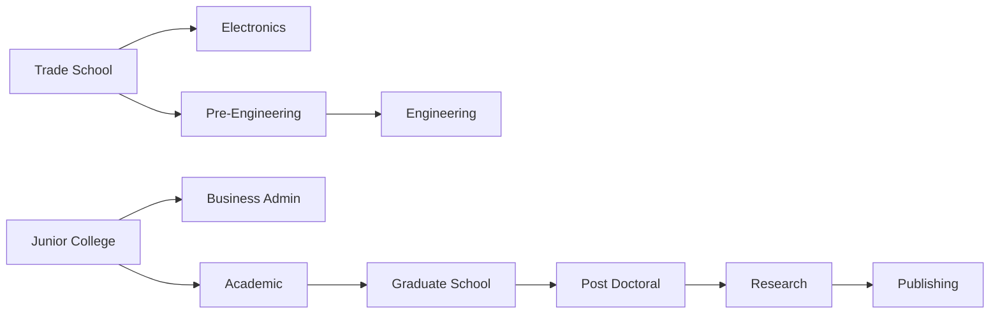
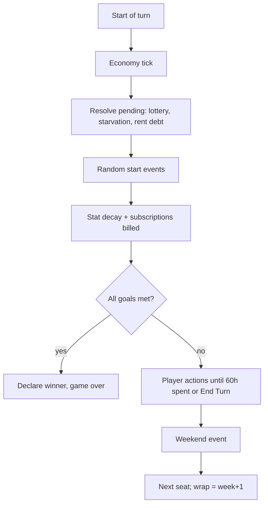
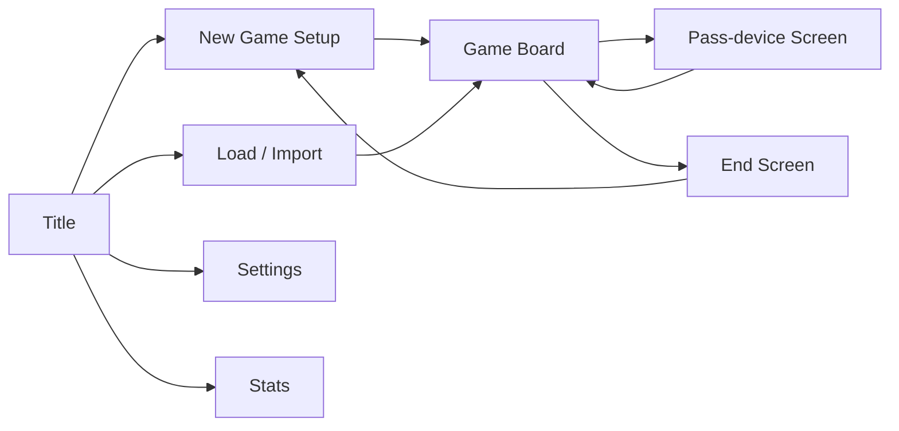

# Hustle Ring (working title) — Remake Spec Pack for Claude Code

2026-09-17

## 0. How to use this pack

This doc is the complete, self-sufficient input for Claude Code (CC) to build a modern remake of a 1991 life-sim board game with zero human intervention. "Hustle Ring" is a placeholder title; CC proposes final names (see Templates → NAMING.md).

**Hand-over steps (human, once):**

1. Create empty GitHub repo; enable GitHub Pages (source: GitHub Actions).
2. Export each section below into the file path named in its heading (e.g. section 1 → `CLAUDE.md`, section 4 → `docs/GDD.md`).
3. Open repo in Claude Code, give the single prompt: `Read CLAUDE.md and execute the plan in docs/MILESTONES.md from M0 to M8 without asking questions.`

**File map:**

| Section | Repo path | Purpose |
| --- | --- | --- |
| 1 | `CLAUDE.md` | Operating contract, commands, invariants |
| 2 | `docs/PRD.md` | Vision, scope, locked decisions |
| 3 | `docs/ORIGINAL_REFERENCE.md` | Researched baseline of the 1991 original |
| 4 | `docs/GDD.md` | Authoritative game rules |
| 5 | `docs/ARCHITECTURE.md` | Packages, engine API, AI, save/replay |
| 6 | `docs/CONTENT_SCHEMAS.md` | CityPack schemas + content requirements |
| 7 | `docs/UX_SPEC.md` | Screens, HUD, tutorial, input, a11y |
| 8 | `docs/AUDIO_SPEC.md` | AudioBus, SFX, procedural music |
| 9 | `docs/BALANCE_SPEC.md` | Two-stage calibration + CI gates |
| 10 | `docs/MILESTONES.md` | M0–M8 tasks + acceptance criteria |
| 11 | `PROGRESS.md`, `DECISIONS.md`, `KNOWN_ISSUES.md`, `NAMING.md` | Living templates |
| 12 | `docs/EXTENSIBILITY.md` | Rule modules, registries, overlays, v2 seams |
| 13 | `docs/STATE_MODEL.md` | Integer numerics, PlayerState, ErrorCode, DomainEvent |
| 14 | `docs/SEED_DATA.md` | Concrete classic job/item/event/market tables |
| 15 | `docs/BUILD_READINESS.md` | Toolchain files, scripts, seeds, CI budgets, amendments |
| 16 | `docs/ROADMAP_SCAFFOLDS.md` | v1 non-goals as stubs, multi-city world, MMO + leaderboard plan |

**Precedence when docs conflict:** GDD > STATE_MODEL > BALANCE_SPEC > EXTENSIBILITY > ROADMAP_SCAFFOLDS > ARCHITECTURE > CONTENT_SCHEMAS > UX_SPEC > SEED_DATA > ORIGINAL_REFERENCE > BUILD_READINESS > PRD. ORIGINAL_REFERENCE governs only the `classic` ruleset values; GDD governs all rules.

**Keywords:** MUST / MUST NOT / SHOULD / MAY per RFC 2119. Every MUST is testable and has a matching acceptance criterion in MILESTONES.

## 1. CLAUDE.md — operating contract

You are building the entire game autonomously. Never ask the human a question; never wait for input. Read this file at the start of every session and after every context compaction.

### 1.1 Session start ritual

1. Read `CLAUDE.md`, `PROGRESS.md`, `DECISIONS.md`, `KNOWN_ISSUES.md`.
2. Resume at the first unchecked task in `PROGRESS.md`.
3. Read only the docs sections that task cites.

### 1.2 Commands (MUST exist and pass at every milestone gate)

```bash
pnpm install --frozen-lockfile
pnpm lint            # eslint + prettier --check, zero warnings
pnpm typecheck       # tsc -b, strict, no any
pnpm test            # vitest, all packages, coverage thresholds enforced
pnpm test:e2e        # playwright, 3 viewports, includes axe checks
pnpm sim:gate        # 500 seeded games per gate config, asserts BALANCE_SPEC
pnpm sim -- --games 10000 --pack classic --out reports/  # full run
pnpm check:banned    # banned-terms scan over src, content, docs output
pnpm build           # vite build, bundle budget check
pnpm verify          # runs all of the above in order
```

### 1.3 Invariants (never violate)

- `packages/engine` MUST be pure: no DOM, no `Date.now()`, no `Math.random()`, no I/O. Randomness only via injected seeded RNG.
- All state mutation MUST go through `applyCommand(state, command) → {state, events}`. UI and AI use the identical API.
- `GameState` MUST be JSON-serializable and structurally cloneable. Same seed + same command log MUST reproduce identical state (hash-checked in tests).
- Game rules and numbers MUST live in CityPack content (JSON validated by Zod), not hardcoded in engine logic.
- AI MUST NOT read hidden information (other players' future RNG draws, unrevealed events).
- No external network calls at runtime. No analytics, cookies, or third-party assets. All visuals are code-rendered placeholders behind `AssetRegistry`.
- All user-facing strings MUST use i18n keys.
- Banned terms (see PRD §2.6) MUST NOT appear in code, content, UI or generated docs.
- TypeScript `strict: true`, `noUncheckedIndexedAccess: true`. No `any`, no `@ts-ignore` without an ADR.

### 1.4 Ambiguity policy

When the spec is silent or ambiguous: choose the simplest option consistent with GDD and invariants, implement it, and append an ADR to `DECISIONS.md` (context, options, decision, consequence). Never stop to ask.

### 1.5 Stuck policy

After 3 failed attempts to fix the same failure: isolate the feature behind a feature flag (default off unless required by a gate), log it in `KNOWN_ISSUES.md` with reproduction steps, and continue. A milestone gate MUST NOT be passed by disabling a test that the gate requires; if a gate criterion is unreachable after tuning, log it and record the achieved value, then continue.

### 1.6 Work loop per task

1. Write or update tests first for the task's acceptance criteria.
2. Implement.
3. Run the narrowest relevant command, then `pnpm verify` before marking a task done.
4. Tick the task in `PROGRESS.md` with a one-line note.
5. Commit with Conventional Commits (`feat(engine): ...`), one commit per task.
6. At milestone completion: tag `m<N>` and push; CI must be green.

### 1.7 Coverage thresholds

| Package | Lines | Branches |
| --- | --- | --- |
| engine | 90% | 85% |
| ai | 80% | 70% |
| content (schema + validators) | 90% | 80% |
| web | 60% | 50% |

### 1.8 Definition of done (whole project)

All M0–M8 acceptance criteria met, `pnpm verify` green in CI, game deployed to GitHub Pages, `README.md` explains play and dev setup, `BASELINE_REPORT.md` and `BALANCE_REPORT.md` committed.

## 2. docs/PRD.md — product requirements

### 2.1 Vision

A browser-based, turn-based life-simulation board game that faithfully reproduces the 1991 original's core loop (four life goals, weekly time budget, ring of city locations, jobs, education, shopping, economy) and layers 2026 satire on top: gig work, transport choices, food delivery, subscription creep, loans, volatile modern investments, AI layoffs, scams, going viral and burnout.

### 2.2 Goals

- G1: A `classic` ruleset that plays like the original, used as the balance baseline and shippable as "Classic" mode.
- G2: A `modern-western` ruleset (default) with all 2026 systems on, balanced relative to classic.
- G3: Solo vs AI and local hotseat for 1–4 seats, any mix of human/AI.
- G4: Engine designed so online multiplayer and simultaneous turns can be added later without rewriting rules.
- G5: Fully autonomous build by Claude Code with measurable acceptance criteria.

### 2.3 Non-goals (v1)

Online multiplayer, simultaneous-turn implementation, final art, accounts, leaderboards, cloud save, languages other than English, native apps, monetization, analytics, additional city packs beyond `classic` and `modern-western`. Every item is stubbed behind a typed contract with a REPLACE ME guide per section 16.1; none is implemented for real in v1.

### 2.4 Locked decisions

| # | Area | Decision |
| --- | --- | --- |
| 1 | Platform | Browser SPA, TypeScript + Vite, static hosting |
| 2 | Players | Solo vs AI + local hotseat 1–4 seats; online-ready engine for later |
| 3 | Turns | Sequential weekly turns with time budget (v1); `TurnScheduler` interface with simultaneous stub for v2 |
| 4 | Win | Original: per-player goal sliders 10–100 for Wealth, Happiness, Education, Career; AI goals random; first to reach all four wins; no week cap; `WinCondition` interface |
| 5 | Stats | 4 original goals + Wellbeing (0–100) survival stat, not a win goal |
| 6 | Setting | `CityPack` content abstraction; v1 pack = fictional Western city, USD-style currency; KL-inspired and global packs later |
| 7 | Board | Ring board, 1:1 modernized mapping of original locations |
| 8 | Movement | v1 transport modes: walk, transit, ride-hail, car; chosen per trip |
| 9 | Transport acquisition | Transit pass at City Services counter; used car at pawn-shop equivalent; new car at discount-store equivalent via bank loan; ride-hail unlocked by owning a smartphone |
| 10 | Jobs | Original hiring formula, modern titles, plus ungated gig jobs with zero career value |
| 11 | Education | Original degree tree and class counts, modern names, plus online study at home (laptop + internet subscription) |
| 12 | Needs | Original housing/food/clothing/theft loop + food delivery + subscription creep + rent hikes |
| 13 | Economy | Economy index + 6 assets (savings, bonds, index ETF, tech stock, crypto, gold) + index-linked loans |
| 14 | Events | All classic events + AI layoffs, going viral, scams/phishing, gadget breakdown; Chaos level setting |
| 15 | AI | Utility planner on the same command API, Easy/Normal/Hard + personalities |
| 16 | Stack | pnpm monorepo; React 18 + TS + Vite; SVG/DOM board; Zustand; Tailwind; Framer Motion; Vitest; Playwright |
| 17 | Art | Placeholder geometric shapes behind `AssetRegistry`; real art later |
| 18 | Audio | WebAudio SFX + procedural music loop, separate volumes + mute |
| 19 | Save | IndexedDB autosave each turn + 3 manual slots + JSON export/import + replay log; versioned schema |
| 20 | Devices | Desktop + tablet primary; phone alternate layout; full keyboard control |
| 21 | Language/tone | English with i18n infra; satirical tone; IP-safe names generated by CC with banned-terms check |
| 22 | Visibility | Full HUD, tutorial, action previews, standings, event log; "Classic opacity" toggle |
| 23 | Balance | Two-stage: sim classic baseline first, then modern targets relative to baseline |
| 24 | Original data | Researched reference (section 3) with ASSUMED tags for gaps |
| 25 | Hosting | GitHub + Actions CI → GitHub Pages |
| 26 | Execution | Gated milestones M0–M8, never-ask ADR policy, 3-strike stuck policy |
| 27 | A11y/setup | WCAG 2.2 AA with axe gate; full new-game setup options |

### 2.5 Success metrics

All BALANCE_SPEC gates pass; zero serious/critical axe violations; Lighthouse performance ≥ 90 on desktop; initial JS bundle ≤ 350 kB gzip (music engine lazy-loaded); a full solo game at goals=50 is completable in a Playwright run using the AI-autoplay debug switch.

### 2.6 IP safety

The original game's title, character names, location names, brand names, art, audio and text MUST NOT be reused. `pnpm check:banned` MUST fail on any case-insensitive whole-word (regex `\b` boundary) match of: `jones`, `fast lane`, `sierra`, `wild willy`, `monolith burgers`, `socket city`, `hi-tech u`, `black's market`, `qt clothing`, `z-mart`, `le securite`, plus real brands: `grab`, `uber`, `lyft`, `doordash`, `netflix`, `spotify`, `amazon`, `apple`, `iphone`, `tesla`, `bitcoin`, `ethereum`, `robinhood`, `starbucks`, `mcdonald`, `walmart`, `coursera`, `udemy`, `chatgpt`, `openai`. Exception: `docs/ORIGINAL_REFERENCE.md` and the banned-terms config itself are excluded from the scan. Parody names MUST be clearly distinct (not one-letter edits).

## 3. docs/ORIGINAL_REFERENCE.md — 1991 baseline

This section is the ground truth for the `classic` ruleset. Tags: **[SRC]** = documented by a cited source; **[ASSUMED]** = not publicly documented, value chosen by spec author, CC MAY tune it during stage-1 calibration and MUST log changes in `DECISIONS.md`. CC MUST NOT research the web during the build. Original names appear here only for traceability; they are banned everywhere else. Research note: fan-wiki pages were read via search-indexed excerpts (direct page fetch was blocked), so treat [SRC] numbers as high-confidence but cross-check against internal consistency in tests.

### 3.1 Turn and time

- [SRC] Each turn = 1 week of 60 Hours (time points). Moving and actions spend Hours. ([Time](https://jonesinthefastlane.fandom.com/wiki/Time))
- [SRC] Turn ends when a player leaves a location or is travelling with 0 Hours left; inside a location, zero-time actions (buy, deposit) remain allowed. ([Turn](https://jonesinthefastlane.fandom.com/wiki/Turn))
- [SRC] One full lap of the board ≈ 10 Hours; entering any location costs 2 Hours; turns start at the player's apartment. ([Locations](https://jonesinthefastlane.fandom.com/wiki/Locations))
- [SRC] Movement allowed in either direction around the ring. ([Wikipedia](https://en.wikipedia.org/wiki/Jones_in_the_Fast_Lane))
- [SRC] Economy adjusts at the start of each turn; lottery resolves at turn start. ([Turn](https://jonesinthefastlane.fandom.com/wiki/Turn))
- [SRC] A weekend event occurs each week, usually costing under $200 (or earning money if the player owns a computer). ([Wikipedia](https://en.wikipedia.org/wiki/Jones_in_the_Fast_Lane))
- [ASSUMED] Board has 16 squares; 1 lap = 10 Hours → 0.625 Hours per square, rounded to per-move cost `ceil(squares × 0.625)`.

### 3.2 Goals and win

| Goal | Stat formula | Notes |
| --- | --- | --- |
| Wealth | `floor(liquidAssets / 100)`; liquid = cash + bank + stocks; items ignored | [SRC] $10,000 = 100 ([Wealth Goal](https://jonesinthefastlane.fandom.com/wiki/Wealth_Goal)) |
| Education | `1 + 9 × degreeCount`; 11 degrees → 100 | [SRC] never decreases ([Education Goal](https://jonesinthefastlane.fandom.com/wiki/Education_Goal)) |
| Career | `dependability × 1.25`, 0 if unemployed; can drop | [SRC] 80 dependability = 100 ([Career Goal](https://jonesinthefastlane.fandom.com/wiki/Career_Goal), [Dependibility](https://jonesinthefastlane.fandom.com/wiki/Dependibility)) |
| Happiness | Running stat changed by actions, items, events | [SRC] mechanism; [ASSUMED] starts at 10, clamp 0–100 ([Stat](https://jonesinthefastlane.fandom.com/wiki/Stat)) |

- [SRC] Goals set per player at start, each 10–100; AI rival goals random; first to meet all four wins. ([Goals](https://jonesinthefastlane.fandom.com/wiki/Goals))
- [SRC] Win check occurs at the start of the player's turn. ([Wealth Goal](https://jonesinthefastlane.fandom.com/wiki/Wealth_Goal))
- [ASSUMED] Slider step = 10; default 50 each.

### 3.3 Hidden stats

| Stat | Start | Rules | Tag |
| --- | --- | --- | --- |
| Dependability | 20 | −3 per week, min 0; reset to 10 on new job if below 10; +5 per degree (may exceed max); max = `20 + jobRequiredDep + 5 × degrees` | [SRC] |
| Experience | 10 | +1 per work session; never decreases; capped by job/degree-based max | [SRC] ([Experience](https://jonesinthefastlane.fandom.com/wiki/Experience)); [ASSUMED] max = `20 + jobRequiredExp + 5 × degrees` |
| Relaxation | 10 | Relax at home: 6 Hours, +3, max 50; −1 per turn (none if hot tub owned); min 10; high value reduces doctor visits and burglary | [SRC] ([Relaxation](https://jonesinthefastlane.fandom.com/wiki/Relaxation)) |

### 3.4 Jobs and employment

- [SRC] Apply at employment office: 4 Hours; requires experience, dependability, and all listed degrees; success gives +3 Happiness; refusal −1 Happiness. ([Employment Office](https://jonesinthefastlane.fandom.com/wiki/Employment_Office))
- [SRC] Luck roll when qualified: `luck = 30 + (10 + dependability + experience + 8 × degrees) / 3`; roll d100; fail = "no openings", job locked for rest of turn. Entry fast-food cook always approved.
- [SRC] Raise: requires dependability above job requirement; +3 Happiness; requirement +5 per raise, resets on job change.
- [SRC] Work session = 6 Hours → 8 × hourly wage; pro-rated if fewer Hours; needs required uniform (clothing tier) or better; low dependability can cause firing. ([Jobs](https://jonesinthefastlane.fandom.com/wiki/Jobs))
- [SRC] If in rent debt, work pay is garnished 50% + $2 fee.
- [SRC] Severe market crash may fire players; worse crash = higher chance; only penalty is lost Happiness.
- [SRC] Each workplace offers 2–9 jobs. Anchors: Professor $20/hr, exp 50, dep 60, Research degree, dress uniform ([Professor](https://jonesinthefastlane.fandom.com/wiki/Professor)); top job General Manager (factory) ≈ $25/hr, needs two degrees; Broker needs Business Admin + Academic; Engineer needs two degrees.
- [ASSUMED] Full per-job table: CC MUST construct `jobs.classic.json` with 5 tiers per ladder, wages $4–$25 base, requirements monotonic with wage, consistent with every anchor above and with 3.5 degree unlocks. Uniform tiers: none < casual < dress < business suit.

### 3.5 Education

- [SRC] 11 degrees; 2 available at start (Trade School, Junior College). Unlock tree ([Giant Bomb](https://giantbomb.com/wiki/Games/Jones_in_the_Fast_Lane)):



- [SRC] Enroll fee per course, then 10 lessons at 6 Hours each (min 8 lessons with extra-credit items such as encyclopedia/dictionary/atlas set); up to 4 concurrent courses; graduation +5 Happiness, +5 Dependability. ([Hi-Tech U](https://jonesinthefastlane.fandom.com/wiki/Hi-Tech_U))
- [ASSUMED] Enrollment fee $50 base scaled by economy; each of 3 extra-credit items removes 1 lesson, capped at 2 total.

### 3.6 Housing, food, clothing

- [SRC] Two apartment tiers; all start in low-cost. Rent paid monthly (week 4); baseline $325 low-cost, $475 secure; rent locked at move-in, market rent floats with economy, can reach 50% in crash; switching costs 1 month new rent; extension request 1 week, denied forever after any rent debt. ([Rent](https://jonesinthefastlane.fandom.com/wiki/Rent), [Apartments](https://jonesinthefastlane.fandom.com/wiki/Apartments))
- [SRC] Low-cost apartment can be burgled at turn start (−4 Happiness, lose durables; chance lowered by Relaxation); secure apartment never.
- [SRC] Must eat weekly or starve (lose Hours next week). Fast food consumed the following turn. Fresh food needs refrigerator: 1 unit/week, fridge stores 6, freezer 12; spoiled food → doctor bill. ([Black's Market](https://jonesinthefastlane.fandom.com/wiki/Black%27s_Market), [Items](https://jonesinthefastlane.fandom.com/wiki/Items))
- [SRC] Clothes consumed one week at a time; best owned clothes set uniform tier; discount-store clothes last shorter, cost about half of boutique.
- [ASSUMED] Starvation = −20 Hours next turn and −5 Happiness; doctor visit = $30–$60 and −10 Hours.

### 3.7 Stores, items, bank

- [SRC] Discount store: 6 random items each turn, cheaper, appliances break more; exclusive books and tickets; some junk items lower Happiness. ([Z-Mart](https://jonesinthefastlane.fandom.com/wiki/Z-Mart))
- [SRC] Pawn shop: sell owned items; seller can redeem within 2 rounds before others may buy.
- [SRC] Grocery sells fresh food (1/2/4 units), lottery tickets ($10, prizes $200–$5,000), newspaper with economy hints.
- [SRC] Bank broker: 6 instruments — T-Bills, Gold, Silver, Pork Bellies, Blue Chip, Penny Stocks — fluctuating between fixed bounds. Street thief near bank and grocery can steal all cash carried (bank balance safe). ([TV Tropes](https://tvtropes.org/pmwiki/pmwiki.php/VideoGame/JonesInTheFastLane))
- [SRC] Relax happiness rises with owned durables; hot tub stops relaxation decay; some durables need repair.
- [ASSUMED] Item table (price, happiness, durability, breakdown %) to be constructed by CC in `items.classic.json`: ≈ 25 items across food, clothing × 3 tiers, electronics, appliances, books, tickets, junk.

### 3.8 Board locations (classic)

[SRC] 14 service locations + 2 apartments ([Enthusiacs](https://www.enthusiacs.com/a-look-at-jones-in-the-fast-lane/)). Modern mapping for the `modern-western` pack:

| # | Original role | Modern equivalent (placeholder name, CC renames) | Jobs | Services |
| --- | --- | --- | --- | --- |
| 1 | Low-cost housing | Co-living Pod | No | Home, relax, online study |
| 2 | Rent office | City Services Counter | Yes | Rent, move, transit pass |
| 3 | Pawn shop | Resale Kiosk | No | Sell/buy used items, used cars |
| 4 | Discount store | MegaMart Marketplace | Yes | Random deals, new car (loan) |
| 5 | Fast food | Burger Stack | Yes | Meals |
| 6 | Clothing boutique | Threadline | Yes | Clothing tiers |
| 7 | Electronics | GadgetHub | Yes | Phone, laptop, devices, subscriptions |
| 8 | University | Hybrid University | Yes | Courses |
| 9 | Employment office | JobLink Center | Yes | Apply, raise, gig sign-up |
| 10 | Factory | Fulfillment Center | Yes | Work only |
| 11 | Bank | NeoBank Branch | Yes | Deposit, invest, loans |
| 12 | Grocery | FreshCart Grocery | Yes | Food, lottery, news feed |
| 13 | Secure apartments | Guarded Tower Condo | No | Home, relax, online study |
| 14–16 | [ASSUMED] Fillers (appliance store, clinic, empty lots) | Appliance Depot, Clinic, Park | Varies | Appliances; doctor; free relax (walk) |

[ASSUMED] Exact ring order: 1, 2, 3, 4, 5, 6, 7, 8, 9, 10, 11, 12, 13, 14, 15, 16 clockwise, home squares at 1 and 13.

### 3.9 Known gaps (all [ASSUMED], resolved in stage 1)

Happiness change table; economy index formula and crash frequency; stock bound values; weekend event table; AI rival heuristics; burglary and theft probabilities; appliance breakdown rates. CC defines each in classic content with an ADR and records resulting behaviour in `BASELINE_REPORT.md`.

## 4. docs/GDD.md — game rules (authoritative)

Rules apply to both rulesets unless marked **[modern]** (only when the ruleset's feature flag is on). All numbers are defaults stored in CityPack `rules.json`; engine reads them, never hardcodes them. Currency unit shown as `$` in both v1 packs.

### 4.1 Game setup

1. Choose ruleset: `classic` or `modern-western` (default).
2. Seats 1–4. Each seat: type Human | AI; AI difficulty Easy | Normal | Hard; AI personality (see 4.14); name (≤ 16 chars); color from color-blind-safe palette; token shape (circle, square, triangle, diamond).
3. Goals per human seat: Wealth, Happiness, Education, Career sliders 10–100 step 10, default 50. AI seats: each goal random uniform from {30..80 step 10} (Easy uses {20..60}, Hard {50..100}).
4. Options: seed (auto from `crypto.getRandomValues` in UI layer, editable), Chaos level Off | Classic | Modern | Chaotic (default Classic for classic ruleset, Modern for modern), Classic opacity on/off, AI animation speed Instant | Fast | Normal.
5. Single seat total → game auto-adds 1 AI seat (Normal, random personality) unless user explicitly sets "Solo practice" (no opponent).
6. Starting state per player: cash $200, bank $0, low-tier home, no job, casual clothing 4 weeks, 0 food, dependability 20, experience 10, relaxation 10, happiness 10, wellbeing 70 [modern], location = home square, week 1.

### 4.2 Turn structure



- Order of start-of-turn steps is fixed exactly as above and MUST be covered by an ordered test.
- Economy tick runs once per week, on the first seat's turn only (not per player) so all players see identical prices within a week.
- Win check uses stats after steps B–E. Ties impossible in sequential mode (first to check wins).
- `End Turn` command allowed any time; unspent hours are lost.
- Hour clock: `hoursLeft` starts at 60 minus penalties (starvation, sickness). Actions requiring N hours with fewer left: work pro-rates pay; study/relax refused; travel moves as far as time allows then turn ends.

### 4.3 Board and movement

- Ring of 16 squares; location IDs and order from `board.json`. Distance = min(clockwise, counter-clockwise) steps; player picks direction automatically by shortest path.
- Entering a location costs `enterHours` = 2.
- Travel cost per mode (modern). Classic has walk only.

| Mode | Hours per step | Money | Unlock | Wellbeing | Events |
| --- | --- | --- | --- | --- | --- |
| Walk | 0.625 | $0 | Always | +1 per trip ≥ 4 steps | Street theft exposure at bank/grocery |
| Transit | 0.35 + 1 fixed wait | Weekly pass $25×econ or $3/trip | Buy pass at City Services | 0 | Delay event (+2h) 5% |
| Ride-hail | 0.2 | $4 + $1.5/step × econ × surge | Own smartphone | 0 | Surge ×1.5–×3 10%; driver no-show +1h 3% |
| Car | 0.15 | Weekly upkeep $40×econ (fuel, insurance, parking) | Own car | −1 per trip in "traffic" event | Breakdown 2%/trip (used 5%) |

- Hour costs are rounded up to 0.5. Minimum trip cost 0.5h.
- Mode selector shows each mode's hours and money before confirm; unavailable modes are shown disabled with reason.
- Car ownership: used car at Resale Kiosk ($2,500–$4,500 × econ), new car at MegaMart ($12,000 × econ, requires loan unless paid cash). Car can be sold at Resale Kiosk for 50% (used) / 60% (new, first 26 weeks) of current value; value depreciates 1%/week.

### 4.4 Goals

| Goal | Formula (clamped 0–100) |
| --- | --- |
| Wealth | `floor((cash + bank + marketValue(investments) − loanPrincipalOutstanding) / 100)`; items excluded [modern subtracts loans; classic has no loans] |
| Education | `1 + 9 × degrees` |
| Career | `floor(dependability × 1.25)` if employed in a non-gig job, else 0 |
| Happiness | Stored stat, changed per 4.9 table |

Wealth goal scale is per CityPack (`wealthPointValue`, default 100). Goal met when stat ≥ target at win check.

### 4.5 Wellbeing [modern]

Wellbeing is a 0–100 survival stat, not a goal.

| Trigger | Delta |
| --- | --- |
| Each 6h work session | −3 (gig −4) |
| Each 6h study session | −2 (online at home −1) |
| Relax at home (6h) | +8 (+2 per comfort durable, max +16) |
| Week with ≥ 12 unspent hours | +5 |
| Walk trip ≥ 4 steps | +1 |
| Starvation | −10 |
| Gym subscription active | +2/week |
| Streaming subscription active | +1/week |
| Loan payment missed | −5 |
| Weekly natural drift | toward 60 by 2 |

| Band | Effect at start of turn |
| --- | --- |
| ≥ 70 | +1 Happiness |
| 25–69 | None |
| 10–24 | "Burnt out": −10 hours this turn, work pay −10%, study lesson 20% chance wasted |
| < 10 | "Collapse": forced rest, player loses entire turn (only zero-hour actions), wellbeing set to 40, dependability −10, 25% job loss chance if employed |

### 4.6 Jobs

- Apply at JobLink Center: 4h. Qualified if experience ≥ req, dependability ≥ req, all required degrees held. Uniform not needed to be hired but needed to work.
- Luck roll (classic formula, 3.4). Fail → "No openings", job locked for this player's turn.
- Hired: +3 Happiness; dependability := max(dep, 10); maxDependability and maxExperience recomputed; wage = listed wage × econ at hire time (locked until raise or change).
- Raise: 4h at JobLink; requires dep > req + 5 × raisesThisJob; wage := current listed wage if higher; +3 Happiness.
- Work (at workplace): 6h → pay `8 × wage`, pro-rated by hours; +1 experience (to max); +dependability `+2` (to max) [ASSUMED]; requires uniform tier ≥ job tier else refused.
- Firing: if dependability < job req − 10 at work attempt → fired (−5 Happiness).
- Garnish: if rent debt, 50% of pay + $2 goes to debt.
- **[modern] Titles:** modern names per ladder (e.g. Fulfillment Center: Picker → Forklift Operator → Shift Supervisor → Operations Engineer → Site General Manager). Content defines 10 workplaces × 3–7 jobs (SEED_DATA 14.1) mirroring classic table requirements exactly, only names/flavor differ.
- **[modern] Gig jobs** (sign up at JobLink, 1h, no roll): Delivery Rider (needs smartphone; walk/transit uses $0 bike), Ride-hail Driver (needs smartphone + car). Work anywhere on the board via `Gig Shift` command in 3h or 6h blocks. Pay = base × econ × demand multiplier (weekly random 0.6–1.6). No experience, no dependability, career stat 0 while gig is the only job. A player MAY hold one regular job and one gig simultaneously; career stat uses the regular job. Gig shift wellbeing −4/6h; driver adds car wear (breakdown chance +1%).

### 4.7 Education

- Degree tree per 3.5; modern names: Vocational Certificate (Trade School), Associate Degree (Junior College), Electronics & IoT, Pre-Engineering, Software Engineering (Engineering), Business Administration, Liberal Arts BA (Academic), Master's, PhD, Research Fellowship (Research), Published Author (Publishing).
- Enroll (0h, fee $50 × econ per course), up to 4 concurrent. Lesson = 6h at university; graduation at 10 lessons (− extra credit, min 8): +5 Happiness, +5 Dependability, education stat recomputed, maxDep/maxExp recomputed.
- **[modern] Online study:** requires owned laptop AND active Home Internet subscription AND being at own home. Lesson 6h, counts identically, wellbeing −1 instead of −2, 15% chance "doomscrolled" → lesson not counted, 6h still spent. Owning a Focus App subscription reduces waste chance to 5%.
- Extra credit items (modern): e-reader, reference software bundle, noise-cancelling headphones; each −1 lesson, cap −2.

### 4.8 Stat decay (start of turn, step E)

- Dependability −3 (min 0). Relaxation −1 (min 10; none with hot tub/massage chair). Clothing weeks −1 per owned outfit in use; 0 → downgrade uniform tier.
- Food: if fridge food ≥ 1 consume 1; else if fast-food meal bought last turn consume it; else starvation (−20h this turn, −5 Happiness, wellbeing −10 [modern]). **[modern]** A delivery meal bought last turn counts as fast food.
- Spoilage: fresh food held without fridge spoils at turn start → doctor event.
- **[modern] Subscriptions billed** from bank, then cash; unpaid → auto-cancel + −2 Happiness.

### 4.9 Happiness table

| Source | Delta |
| --- | --- |
| Hired / raise | +3 |
| Application refused | −1 |
| Fired / laid off | −5 |
| Graduation | +5 |
| Relax at home (first per turn) | +2 + 1 per comfort durable (max +6) |
| Buy durable (first of type) | item `happinessOnBuy` (1–6) |
| Tickets / junk items | item value (−3..+4) |
| Burglary / theft | −4 |
| Starvation | −5 |
| Move to secure housing | +5 once |
| Weekend event | event value |
| Wellbeing ≥ 70 [modern] | +1/turn |
| Viral event [modern] | +8 |

Happiness clamps 0–100. Starts at 10.

### 4.10 Housing and rent

- Tiers: low (Co-living Pod) and high (Guarded Tower Condo). Baseline rent $325 / $475 × econ; locked at move-in. Rent due every 4th week; pay at City Services (0h) any time in advance for N months.
- Rent not paid by end of due week → rent debt; extension request (1h, 60% approve) pushes deadline 1 week; any past debt → extensions always denied.
- Rent debt → garnish 50% + $2 of work pay; eviction after 8 weeks of debt: moved to low tier, durables >2 lost.
- Low tier burglary at turn start: `p = clamp(0.02 + 0.01 × durablesOwned − 0.0008 × relaxation, 0.005, 0.15)`; steals 1–all durables.
- **[modern] Rent hikes:** on each rent renewal (week 4k) with probability 0.25 × chaos multiplier, locked rent rises 5–15%; high tier has 0.10. Notice shown one week ahead via news feed.
- **[modern] Co-living quirks:** roommate borrows food event (−1 fridge unit, 5%/week).

### 4.11 Food, clothing, items, subscriptions

- Fast food meal at Burger Stack: $6–$12 × econ, 0h beyond entry. **[modern] Delivery:** with smartphone, `Order Delivery` command anywhere, 0.5h, price = meal × 2.2, 5% "order lost" (money refunded 50%, no meal).
- Groceries at FreshCart: 1/2/4 units, $15/unit × econ; fridge cap 6, fridge+freezer 12.
- Clothing tiers at Threadline: casual $60 (8 weeks), dress $150 (10 weeks), business $300 (12 weeks); MegaMart versions 50% price, 60% duration.
- Items MUST be content-defined with fields: id, category, price, storeIds, happinessOnBuy, comfort (bool), extraCredit (bool), breakdownPerWeek, repairCost, resaleFactor, unlocks (e.g. `rideHail`, `onlineStudy`, `delivery`, `gigDelivery`).
- Required modern items: smartphone, laptop, tablet, smart TV, game console, e-reader, noise-cancelling headphones, fridge, freezer, air-fryer, robot vacuum, massage chair (hot-tub equivalent), bike, phone case/insurance, gym membership card (links gym sub).
- **[modern] Subscriptions** (start/cancel at GadgetHub, except Gym at City Services and Food Club at Burger Stack): Home Internet $15, Streaming $12, Music $8, Cloud Storage $3, Gym $25, Focus App $5, Food Club (delivery fee −30%) $9. Each has weekly price, happiness or wellbeing effect, and `priceDrift`: every 8 weeks 30% chance +10–20%. Weekly total shown in HUD. Cancel requires visiting the location where started (satire: "retention offer" dialog with one extra confirm).

### 4.12 Economy, investments, loans

- Economy index `econ` ∈ [0.5, 1.6], start 1.0. Weekly update: `econ = clamp(econ × (1 + drift + noise))`, phase Boom (drift +0.004), Stable (0), Recession (−0.006); noise N(0, 0.012); phase transition each week with p = 0.04 per adjacent phase. Crash event (see 4.13) multiplies econ by 0.75–0.9.
- Prices, rents, wages at hire, fees scale by `econ`. Existing wages and locked rents do not auto-change.
- News feed at FreshCart (classic: newspaper $1; modern: free with smartphone anywhere) shows next-week phase hint with 70% accuracy.
- Investments at bank (0h inside). Classic: T-Bills, Gold, Silver, Commodities, Blue Chip, Penny Stocks, each bounded random walk. **[modern]:**

| Asset | Weekly drift | Volatility | Econ correlation | Special |
| --- | --- | --- | --- | --- |
| Savings | +0.05% | 0 | 0 | Always safe |
| Bonds | +0.12% | 0.3% | −0.2 | — |
| Index ETF | +0.15% | 2% | +0.7 | — |
| Tech Stock | +0.2% | 5% | +0.8 | AI-boom event +20% |
| Crypto | +0.1% | 12% | +0.4 | Rug-pull event −60–90%, 0.8%/week |
| Gold | +0.08% | 1.5% | −0.5 | Crash event +10% |

- Buy/sell in whole dollars, 1% fee (crypto 2%). Prices start at 100. Correlated returns computed from shared econ shock + idiosyncratic noise (seeded).
- **[modern] Loans** at NeoBank: principal $500–$15,000; approval if `weeklyIncomeEstimate × 52 × 0.4 ≥ principal` or car collateral; APR = 6% + 4% × (econ − 1) + 8% if dependability < 30; weekly payment amortized over 52 or 104 weeks, auto-debited at turn start. Missed payment: +$25 fee, wellbeing −5; 4 missed → default: collateral repossessed, pay garnished 30% until cleared. Early repayment allowed, no penalty.

### 4.13 Events

Events are content-defined: `{id, family, trigger: 'turnStart'|'weekend'|'onEnter:<loc>'|'onAction:<cmd>', conditions (JSON-logic), baseWeight, chaosWeights {off,classic,modern,chaotic}, effects[], textKey}`. At most 1 start-of-turn random event per player per turn, plus 1 weekend event. Chaos multipliers: Off 0 (weekend still runs, neutral only), Classic 1, Modern 1.3, Chaotic 2.

| Family | Examples (effects) | Ruleset |
| --- | --- | --- |
| Classic: theft | Street thief at bank/grocery exit steals cash (p 3% if cash > $200) | both |
| Classic: burglary | Low-tier home durables stolen | both |
| Classic: breakdown | Appliance broken, repair cost | both |
| Classic: economy | Boom news, recession, market crash (job-loss chance 10–100% by severity) | both |
| Classic: weekend | Cheap weekend −$20–$200; with computer earn +$50–$150 | both |
| Classic: lottery | Resolve tickets: prizes $200–$5,000 | both |
| Classic: doctor | Sick: −10h, $30–$60 | both |
| AI layoffs | Job automated: fired if job has `automationRisk` ≥ roll; severance 2 weeks wage; next course enrollment free | modern |
| Going viral | +8 Happiness, +$100–$1,000 if smartphone; 30% chance backlash next week −3 | modern |
| Scams & phishing | Lose 5–30% bank; chance × (1 − 0.08 × degrees), ×0.5 if Cloud Storage/2FA item | modern |
| Gadget breakdown | Cracked screen/battery: smartphone or laptop disabled until repaired; phone case halves chance | modern |
| Rent hike / surge / delivery lost / transit delay | Per 4.3, 4.10, 4.11 | modern |

`automationRisk` per job in content: entry clerical and warehouse jobs 0.3–0.5, trades 0.1, management/teaching 0.05. Base layoff weight 1.5%/week for employed players.

### 4.14 AI rival (behavioral spec)

- Uses only public state + own private state. Plans each turn by beam search (width W, depth D) over command sequences within remaining hours; stops when plan exhausts hours or no positive-utility action.
- Utility = Σ goal weights × normalized goal gap closed + wellbeing term + risk term − cost of time; weights from personality.

| Difficulty | W × D | Score noise | Lookahead weeks | Investing |
| --- | --- | --- | --- | --- |
| Easy | 3 × 3 | σ = 0.35 | 0 | Savings only |
| Normal | 6 × 5 | σ = 0.1 | 2 | ETF/bonds |
| Hard | 12 × 8 | 0 | 6 | All assets, econ-phase aware |

| Personality | Traits |
| --- | --- |
| Grinder | Career/wealth weight ×1.4, low relax, walks |
| Scholar | Education weight ×1.6, online study |
| Hustler | Gig + ride-hail, crypto risk tolerance high |
| Balanced | Equal weights, keeps wellbeing ≥ 50 |

- AI MUST finish its turn within 250 ms on Normal and 1,000 ms on Hard (median, desktop) — enforced by benchmark test.
- AI actions are recorded as normal commands; UI replays them with animation per speed setting.

### 4.15 Commands (complete list)

`Move{to, mode}`, `Enter{loc}`, `Exit`, `ApplyJob{jobId}`, `AskRaise`, `Work{hours}`, `GigSignup{gigId}`, `GigShift{hours}`, `Enroll{degreeId}`, `Study{degreeId}`, `Relax`, `BuyItem{itemId, qty}`, `SellItem{itemId}`, `RedeemPawn{itemId}`, `BuyFood{units}`, `EatMeal{mealId}`, `OrderDelivery{mealId}`, `PayRent{months}`, `RequestExtension`, `MoveHome{tier}`, `Deposit{amount}`, `Withdraw{amount}`, `BuyAsset{assetId, amount}`, `SellAsset{assetId, amount}`, `TakeLoan{principal, termWeeks, collateral?}`, `RepayLoan{amount}`, `Subscribe{subId}`, `Unsubscribe{subId}`, `BuyTransitPass`, `BuyCar{source, financed}`, `SellCar`, `Repair{itemId}`, `BuyLottery{qty}`, `ReadNews`, `TravelCity{to}` (disabled unless the world has >1 city), `EndTurn`. Every command has: validation rules, hour cost, money cost, effects, emitted domain events — CC MUST implement a validator per command returning typed error codes (e.g. `ERR_NOT_ENOUGH_HOURS`, `ERR_NOT_AT_LOCATION`, `ERR_UNIFORM_REQUIRED`).

### 4.16 Game end

Winner declared at win check; remaining seats do not take turns. End screen: winner, weeks elapsed, per-player goal chart over time, key stats (total earned, degrees, highest job, net worth, events suffered), buttons: Rematch (same seats, new seed), New Game, Export Replay. Engine `score(state, seat)` (16.7) is computed and submitted to `LeaderboardService`.

## 5. docs/ARCHITECTURE.md

### 5.1 Repository layout

```text
/
├─ CLAUDE.md  PROGRESS.md  DECISIONS.md  KNOWN_ISSUES.md  NAMING.md  README.md
├─ docs/                       # this spec pack
├─ packages/
│  ├─ engine/    # pure rules: state, commands, validators, scheduler, win, rng, events runtime
│  ├─ content/   # Zod schemas + packs: classic/, modern-western/ ; loader + validator CLI
│  ├─ ai/        # utility planner, personalities, difficulty configs
│  ├─ sim/       # headless runner CLI, stats aggregation, report writers
│  ├─ shared/    # types, i18n key types, result/error types
│  └─ platform/  # provider-agnostic contracts + Local*/Null* defaults (identity, transport, saves, leaderboard, telemetry)
├─ apps/web/     # React app
│  ├─ src/store/  (Zustand)  src/ui/  src/board/  src/audio/  src/save/  src/i18n/  src/assets/
│  └─ e2e/        # Playwright specs
├─ tools/        # check-banned.ts, bundle-budget.ts
└─ .github/workflows/ci.yml, deploy.yml
```

Dependency rule: `shared` ← `content` ← `engine` ← `ai` ← `sim`; `shared` ← `platform`; `apps/web` depends on all but `sim`. Enforced by `eslint-plugin-boundaries`.

### 5.2 Toolchain (pin exact versions in lockfile)

Node 22 LTS, pnpm 9, TypeScript 5.x strict, Vite 6, React 18, Zustand 5, Tailwind 3, Framer Motion 11, Zod 3, i18next + react-i18next, idb (IndexedDB wrapper), Tone.js (lazy-loaded chunk), lucide-react, Vitest, fast-check (property tests), Playwright + @axe-core/playwright, ESLint 9 flat config, Prettier.

### 5.3 Engine API

```ts
export interface GameConfig { packId: string; // validated against loaded packs
   seats: SeatConfig[]; seed: string; chaos: Chaos; classicOpacity: boolean; }
export interface GameState { schemaVersion: number; config: GameConfig; week: number; activeSeat: number; econ: EconState; market: MarketState; players: PlayerState[]; pawnShop: PawnEntry[]; rng: RngState; log: LoggedCommand[]; winner: number | null; flags: FeatureFlags; }
export type Command = { type: 'Move'; to: LocationId; mode: TransportModeId } | { type: 'Work'; hours: number } | /* ...all of GDD 4.15 */ ;
export interface ApplyResult { state: GameState; events: DomainEvent[]; }
export type Validation = { ok: true; preview: ActionPreview } | { ok: false; code: ErrorCode; params?: Record<string, unknown> };

export function createGame(config: GameConfig, pack: CityPack): GameState;
export function validate(state: GameState, seat: number, cmd: Command, pack: CityPack): Validation;
export function applyCommand(state: GameState, seat: number, cmd: Command, pack: CityPack): ApplyResult; // throws only on programmer error; invalid cmds return state unchanged + ErrorEvent
export function legalCommands(state: GameState, seat: number, pack: CityPack): Command[]; // used by AI + UI enablement
export function previewCommand(state: GameState, seat: number, cmd: Command, pack: CityPack): ActionPreview; // hours, money, stat deltas, risk %
export function stateHash(state: GameState): string; // stable, key-sorted
```

- State updates are immutable (structural sharing via Immer is allowed inside engine).
- `DomainEvent` is a discriminated union used by UI for animation, audio cues, event log and tutorial triggers.

### 5.4 RNG

- Algorithm: `xoshiro128**` seeded via `cyrb128(seed)`; state stored in `GameState.rng`.
- Separate named streams derived per purpose (`economy`, `market`, `events:<seat>`, `jobs:<seat>`, `ai:<seat>`) so adding a new random draw in one subsystem does not shift others. Stream derivation: `seed + ':' + streamName`.
- AI stream MUST NOT be consumed by engine rules; AI randomness never affects game outcome except via chosen commands.

### 5.5 Turn scheduling and win

```ts
interface TurnScheduler { current(state): SeatRef[]; canAct(state, seat): boolean; onEndTurn(state, seat): GameState; }
class SequentialScheduler implements TurnScheduler { /* v1 */ }
class SimultaneousScheduler implements TurnScheduler { /* v2 stub: throws NotImplemented; contract tests skipped with reason */ }
interface WinCondition { evaluate(state, seat): { met: boolean; progress: GoalProgress[] }; }
class AllGoalsRace implements WinCondition { /* v1 */ }
```

Simultaneous-mode conflict rules to document now (not implement): commands resolved in seat order rotated weekly; shared resources (pawn listings, job "no openings" lock) resolved first-come by rotated order; simultaneous winners → highest sum of (stat − target) wins, then lowest seat index.

### 5.6 Web app state

- Zustand store holds `GameState`, UI state (selected location, open panel, modals), settings. Only action: `dispatch(cmd)` → engine `applyCommand` → set state → push events to an `EventQueue` consumed by animation/audio/log.
- AI turns run in a Web Worker (`ai.worker.ts`) via Comlink-style message passing; UI shows "Thinking…" and replays returned command list.
- Rendering: board as responsive SVG (`viewBox` 0 0 1000 1000); locations placed on a rounded-square ring; tokens animated with Framer Motion along path. All visuals resolved via `AssetRegistry.get(key)` returning a React component; v1 registry = placeholder shapes + Lucide icons.

### 5.7 Save and replay

- IndexedDB DB `game` stores: `autosave` (1 record), `slots` (3), `settings`, `stats`.
- Save record: `{ schemaVersion, packId, packVersion, createdAt, week, seatsSummary, config, commandLog, finalHash?, snapshot }`. Snapshot = full `GameState` for fast load; command log for replay and verification.
- Load path: if `schemaVersion` < current → run migrations `migrations[n](record)` sequentially; then verify by replaying log from seed and comparing `stateHash` to snapshot (mismatch → load snapshot, show warning, log to console).
- Export: JSON file download `save-<title>-week<N>.json`; import validates with Zod.
- Autosave on every `EndTurn` and every 10 commands.

### 5.8 Online-readiness (v2, no implementation)

Command log is the network unit; server authoritative = runs same engine; client prediction by applying locally then reconciling on hash. No engine code may assume single-client; no `window` access in engine; seat identity passed explicitly.

### 5.9 CI/CD

- `ci.yml` on push/PR: install → lint → typecheck → test (coverage) → check:banned → build → bundle budget → Playwright (chromium, 3 viewports) → sim:gate. Upload `apps/web/dist` and reports as artifacts.
- `deploy.yml` on push to `main` after CI: build with `base: '/<repo>/'`, copy `index.html` to `404.html`, deploy via `actions/deploy-pages`.
- Caching: pnpm store, Playwright browsers.

## 6. docs/CONTENT_SCHEMAS.md — CityPack

A CityPack is a folder of JSON files validated by Zod at build time (`pnpm content:validate`, part of `pnpm test`) and at load time. Engine code MUST only reference IDs, never display names.

### 6.1 Pack files

| File | Contents | Validation beyond schema |
| --- | --- | --- |
| `world.json` | WorldPack: id, version, cities[{packId, displayNameKey, unlock}], travel[], sharedEconomy (16.2) | every packId loads; travel refs valid |
| `pack.json` | id, version (semver), currency {symbol, code}, featureFlags, wealthPointValue, extends? | `extends` resolves to existing pack; deep-merge by id |
| `rules.json` | all GDD numeric constants (hours, decay, formulas' coefficients, probabilities) | every key used by engine exists (typed via `z.infer`) |
| `board.json` | `topology: 'ring' \| 'graph'`; ring: squares[16] {index, locationId or null, label key}; graph: nodes[] + edges[{from, to, steps, modes?}] + `layout.json` positions | ring: exactly 16, each location once, 2 home squares; graph: connected, integer steps |
| `locations.json` | id, kind (home, store, workplace, service, filler), services[], open rule, audio mood | services reference valid commands |
| `jobs.json` | id, workplaceId, titleKey, baseWage, reqExperience, reqDependability, reqDegrees[], uniformTier, automationRisk, isGig, gigRequires[], openings (default unlimited) | wages monotonic with reqs within a workplace; ids unique |
| `degrees.json` | id, nameKey, prereqs[], lessons, feeBase | DAG acyclic; exactly 11; 2 roots |
| `items.json` | GDD 4.11 item fields | storeIds valid; unlock keys from enum |
| `meals.json` | id, locationId, price, happiness, deliveryEligible | — |
| `clothing.json` | tier, store, price, weeks | tiers cover none→business |
| `transport.json` | mode id, hoursPerStep, fixedHours, cost model, unlock, wellbeing, event ids | classic pack: walk only |
| `subscriptions.json` | id, locationId, weeklyPrice, effects, priceDrift | modern only |
| `assets.json` | id, drift, vol, econCorr, fee, specialEvents[] | correlations ∈ [−1,1] |
| `loans.json` | min, max, terms[], aprModel, missedFee, defaultAfter | modern only |
| `events.json` | GDD 4.13 event schema | conditions parse as JSON-logic; effects typed |
| `personalities.json` | id, weights, riskTolerance, preferences | — |
| `i18n/en.json` | all text keys incl. flavor quips (≥ 3 greetings per location) | every key referenced exists; no unused keys |
| `assets.registry.json` | visual keys → placeholder spec {shape, color token, icon} | every location/item/avatar key mapped |

### 6.2 Effect DSL (events, items, subscriptions)

```ts
type Effect =
  | { op: 'stat'; stat: 'happiness'|'wellbeing'|'dependability'|'experience'|'relaxation'; delta: number | Range }
  | { op: 'money'; account: 'cash'|'bank'; delta: number | Range | { pctOf: 'cash'|'bank'; pct: Range } }
  | { op: 'hours'; delta: number }                     // this turn
  | { op: 'loseJob'; severanceWeeks?: number }
  | { op: 'loseItems'; filter: ItemFilter; count: number | 'all' | Range }
  | { op: 'disableItem'; itemId: ItemId; untilRepaired: true }
  | { op: 'econ'; multiply: Range } | { op: 'asset'; assetId: AssetId; multiply: Range }
  | { op: 'grant'; what: 'freeEnrollment' | 'meal'; qty: number }
  | { op: 'schedule'; eventId: EventId; inWeeks: number; chance: number };
type Range = { min: number; max: number; int?: boolean };
```

All ranges resolved by the seat's `events` RNG stream. Conditions use JSON-logic over a whitelisted read-only view: `player.*`, `econ.phase`, `week`, `location`.

### 6.3 Pack content requirements

- `classic`: values from section 3 ([SRC] exact, [ASSUMED] as specified); original-role placeholder names that are IP-safe (e.g. "Discount Store", "Burger Joint"), never original names.
- `modern-western`: `extends: classic`; overrides names/flavor; enables flags `transport, gig, delivery, subscriptions, rentHikes, loans, modernAssets, modernEvents, wellbeing, onlineStudy`; adds modern items/events.
- Minimum flavor text: 3 greetings + 3 farewells per location, 1 news headline per econ phase × 5 variants, 1 text per event × 2 variants, tutorial script keys, satirical item descriptions. Tone rules: punch at systems and trends (hustle culture, subscriptions, landlords, crypto hype), never at protected groups or real people; no profanity.
- Feature flags are booleans in `pack.json`; engine subsystems check flags; UI hides disabled features entirely.

### 6.4 Placeholder visual spec

- Locations: rounded rectangles, fill from category token (home, retail, work, finance, education, service), Lucide icon + short label, current-player-here ring highlight.
- Tokens: player color + shape + initial; 4 palettes checked for deuteranopia/protanopia/tritanopia distinction (ΔE ≥ 20 via test on hex values).
- Items/avatars: circle badge with icon + text; avatars = colored circle with initials and one of 8 simple geometric "hair" shapes.
- Theme tokens in CSS variables; light and dark themes; `prefers-color-scheme` default.

## 7. docs/UX_SPEC.md

### 7.1 Screen map



| Screen | Required elements |
| --- | --- |
| Title | Continue (if autosave), New Game, Load, Settings, Stats, How to Play, version + seed display |
| New Game Setup | GDD 4.1 fields; presets (Quick: goals 30, Standard: 50, Marathon: 80); Start disabled until valid |
| Game Board | Ring board center; HUD; location panel; event log drawer; menu (save, load, settings, quit) |
| Pass-device | Hotseat only, shown before each human turn when >1 human: "Pass to &lt;name&gt;" + Ready button; hides previous player's private info |
| End | GDD 4.16 |
| Settings | Music/SFX volume + mute, reduced motion, text scale 100/125/150%, theme, AI speed, Classic opacity default, language (EN only), reset data |
| Stats | Games played, wins by ruleset, fastest win (weeks), highest net worth |

### 7.2 Game board layout

- **Desktop/tablet (≥ 768px):** board SVG left/center (max square), right column 360px: HUD top, location panel below. Event log bottom drawer.
- **Phone (< 768px):** top compact HUD bar (week, hours ring, cash, 4 goal mini-bars, wellbeing); middle mini-ring (tap to expand full-screen board) + scrollable location list sorted by travel time; actions in bottom sheet.
- Travel: tap/click location → travel sheet with mode options (hours, cost, availability reason) → confirm → token animates → location panel opens.

### 7.3 HUD

- Always visible: active player name/color, week, hours left (ring + number), cash, bank, 4 goal bars showing current/target with checkmark when met, wellbeing bar with band label [modern], weekly subscription total [modern], loan payment due [modern].
- Standings button → panel: all players' goal progress % and total %.
- Classic opacity ON: goal bars show only filled/unfilled at 25% steps; hidden stats never shown; previews show hours and money only.

### 7.4 Location panel and action preview

- Header: location name, quip, open/closed state.
- Action list from `legalCommands` + disabled actions with reason (i18n from `ErrorCode`).
- Every time-consuming or money-moving action shows a preview line before confirm: `−6h · +$96 · Dependability +2 · Wellbeing −3`. Risky actions show risk % (e.g. "Scam risk 4%").
- Confirm via button or Enter; repeated actions (work, study) support a "repeat until hours run out" toggle that stops on any event.

### 7.5 Events and log

- Start-of-turn events shown as modal cards (title, satirical text, effect chips), dismissed with Enter/click; max 3 stacked.
- Event log drawer: per-week grouped entries for all players (private amounts hidden for other humans in hotseat unless Classic opacity off and settings allow).
- AI turn: compact ticker of AI actions with skip button; speed per setting.

### 7.6 Tutorial (skippable, replayable from menu)

Scripted, triggered on first game or via How to Play; runs in a fixed tutorial seed with 1 human + 1 Easy AI.

1. Welcome: goals and the 60-hour week.
2. Travel to JobLink Center; explains hours per step and transport modes.
3. Apply for entry job (guaranteed); explains requirements.
4. Travel to workplace; work one shift; explains pay, dependability, experience.
5. Buy a meal; explains starvation.
6. Visit university; enroll; explains degrees.
7. Go home; relax; explains happiness and wellbeing.
8. End turn; explains rent every 4 weeks and events.
9. Week 2: bank deposit and one investment preview; street theft warning.
10. Done: tooltip tour of HUD; tutorial ends, normal play continues.

Each step highlights one UI element (spotlight), blocks unrelated input, and advances on the matching `DomainEvent`. Skip at any time.

### 7.7 Keyboard map

| Key | Action |
| --- | --- |
| 1–9, 0, Q, W, E, R, T, Y | Travel to location by ring index (shown as badge) |
| Enter / Space | Confirm / primary action |
| Esc | Back / close |
| Tab / Shift+Tab | Focus navigation |
| M | Cycle transport mode in travel sheet |
| L | Toggle event log |
| G | Standings |
| H | Help overlay |
| Ctrl/Cmd+S | Manual save |
| Shift+E | End turn (with confirm if hours > 6) |

### 7.8 Accessibility (WCAG 2.2 AA)

- All interactive elements are native buttons/links or have ARIA roles; board SVG locations are focusable with `aria-label` including name, distance and hours.
- Live region announces: hours left changes, money changes, events, turn changes.
- Contrast ≥ 4.5:1 text, ≥ 3:1 UI components in both themes; focus ring ≥ 2px visible.
- Target size ≥ 24×24 CSS px (44×44 on touch layouts).
- `prefers-reduced-motion` and setting disable token path animation (instant move) and modal transitions.
- No information conveyed by color alone (shape + initial on tokens, icons + text on status).
- Playwright runs axe on Title, Setup, Board (desktop + phone), Event modal, End screen; 0 serious/critical violations required.

### 7.9 Debug switches (dev + e2e only, `?debug=1`)

Autoplay all seats with AI, set seed, jump to week, grant money, show hidden stats, export state hash. Stripped from production unless `?debug=1` and build flag `VITE_DEBUG_ALLOWED=true` (true in e2e build, false in deploy).

## 8. docs/AUDIO_SPEC.md

All audio is synthesized at runtime; no audio files shipped.

### 8.1 AudioBus

```ts
interface AudioBus {
  unlock(): Promise<void>;                 // call on first user gesture
  playSfx(id: SfxId, opts?: { pitch?: number }): void;
  setMood(mood: MusicMood): void;          // crossfade 1.5s
  setVolume(channel: 'music'|'sfx'|'master', v: number): void; // 0..1, persisted
  mute(muted: boolean): void;              // persisted
}
```

- Implementation: WebAudio `AudioContext`; SFX via small oscillator/noise envelope recipes (jsfxr-style params in `sfx.recipes.ts`); music via Tone.js loaded as a lazy chunk after first gesture.
- `NullAudioBus` used in tests, SSR-less environments, and when WebAudio unavailable.
- Driven only by `DomainEvent`s through a mapping table; engine has no audio knowledge.
- Respect `document.visibilityState` (pause music when hidden).

### 8.2 SFX list

| SfxId | Trigger event | Character |
| --- | --- | --- |
| uiClick | any button | 30ms tick |
| step | token passes square | soft blip, pitch rises with mode speed |
| enter | enter location | two-note chime |
| cashIn | money + | ascending arpeggio |
| cashOut | money − | descending blip |
| hired | job gained | major triad |
| fired | job lost | minor fall |
| graduate | degree | fanfare 4 notes |
| eventGood | positive event | sparkle |
| eventBad | negative event | low buzz |
| alarm | rent due, loan missed, burnout | two-tone alert |
| turnEnd | end turn | clock ding |
| win | winner declared | fanfare 8 notes |
| error | invalid command | short noise burst |

### 8.3 Procedural music

| Mood | When | Spec |
| --- | --- | --- |
| menu | title/setup | 90 BPM, I–vi–IV–V in C major, soft pad + plucked lead |
| normal | econ Stable | 100 BPM, pentatonic generative lead over 8-bar loop, light drums |
| boom | econ Boom | 112 BPM, major, brighter lead, added hi-hats |
| recession | econ Recession | 84 BPM, A minor, sparse, low-pass filtered |
| tension | active player wellbeing < 25 or rent debt | filtered pad drone, heartbeat kick |
| victory | end screen | 1 play of 16-bar major progression then silence |

Generative rules: seeded from a UI-side RNG (not game RNG) so music never affects determinism; lead notes chosen by weighted random walk within scale (step 70%, leap 30%); new phrase every 8 bars. CPU budget: < 3% main thread on desktop (measured with Performance API in a dev check).

## 9. docs/BALANCE_SPEC.md

Balance is proven by simulation, never by feel. Stage 1 measures the classic baseline; stage 2 tunes modern relative to it.

### 9.1 Sim harness

```bash
pnpm sim -- --pack classic --games 10000 --seats 2 --ai normal,normal --goals 50 --seed-base baseline --out reports/classic-50
pnpm sim -- --config sim/gates.json --games 500    # used by sim:gate
```

- Runs in Node worker threads (parallel = CPU count). Each game: seeds `"<seedBase>-<i>"`, AI for all seats, stop at winner or week 300 (stall).
- Outputs per config: `summary.json` (metrics below), `games.csv` (one row per game), `report.md` (tables + ASCII histograms).
- Deterministic: same args → byte-identical `summary.json` (test).

### 9.2 Metrics collected

Game length in weeks (min, p10, median, p90, max); winner seat distribution; winner personality/difficulty; goal completion order (which goal completed last); stall rate; bankruptcy rate (cash+bank < 0 for 4 weeks or eviction); job-tier histogram at end; degrees at end; wealth trajectory p50 by week; events fired per 100 weeks by family; wellbeing band time share [modern]; collapse rate [modern]; loan default rate [modern]; per-strategy win rates (scripted strategy bots, 9.4); sim speed ms/game.

### 9.3 Stage 1 — classic baseline (M3)

Configs: goals {30, 50, 80, 100} (all four equal) × AI {Easy, Normal, Hard} self-play pairs × seats {2, 4}. Output `BASELINE_REPORT.md`.

Stage-1 sanity gates (MUST pass before stage 2; tune [ASSUMED] classic values only):

| Gate | Target |
| --- | --- |
| Stall rate at goals 50 Normal×2 | < 0.5% |
| Median length grows monotonically with goal level | 30 < 50 < 80 < 100 |
| Seat bias Normal×2 | first seat win 45–55% |
| Hard vs Easy | Hard wins ≥ 80% |
| Each goal is last-completed | ≥ 10% of games at goals 50 |
| Sim speed | < 200 ms/game median with Normal AI; Hard-AI games ≤ 120 s/game (sim runs Hard in worker threads; excluded from CI gate) |
| Education-only degree path completes in stall-free games at goals 100 | ≥ 99% |

After gates pass, CC freezes classic numbers (git tag `baseline-frozen`) and records baseline values B(metric, config) in `BASELINE_REPORT.md` and machine-readable `reports/baseline.json`.

### 9.4 Strategy bots (for exploit detection)

Scripted bots implemented in `packages/sim/bots`: `GigOnly` (never regular job), `CryptoAllIn` (all spare cash to crypto), `StudyFirst` (all degrees before work), `NoRelax` (never relaxes), `DeliveryOnly` (never groceries), `LoanMax` (max loan, invest in ETF). Each plays vs Normal Balanced AI, 1,000 games at goals 50.

### 9.5 Stage 2 — modern targets (M6)

Before tuning, CC writes `reports/modern-targets.json` derived from baseline and MUST NOT edit it after first commit (enforced by test comparing file hash to the one recorded in `DECISIONS.md`).

| Gate | Target |
| --- | --- |
| Median length at each goal level | within ±20% of classic B |
| Stall rate | < 0.5% |
| Seat bias | 45–55% |
| Hard vs Easy | ≥ 80% |
| Each goal last-completed | ≥ 10% |
| GigOnly win rate vs Normal | < 25% |
| CryptoAllIn bankruptcy rate | > 40% and win rate 15–40% |
| StudyFirst win rate | 30–60% (viable, not dominant) |
| NoRelax collapse rate | ≥ 60% of games have ≥ 1 collapse |
| Normal Balanced AI collapse | 15–40% of games have ≥ 1 collapse |
| LoanMax default rate | 20–60% |
| No bot beats Normal Balanced > 60% | all bots |
| Every modern event family fires | ≥ 1 per 100 player-weeks at Chaos Modern |
| Sim speed | < 200 ms/game median with Normal AI; Hard-AI games ≤ 120 s/game (sim runs Hard in worker threads; excluded from CI gate) |

### 9.6 Tuning protocol

1. Run full 10,000-game suite; write `BALANCE_REPORT.md` iteration entry (date, commit, failing gates, values).
2. Change at most 3 content constants per iteration; log each with rationale.
3. Only content (`modern-western` overrides) may change; engine logic changes require an ADR.
4. Stop when all gates pass; if 15 iterations fail to converge, apply stuck policy: record best iteration, mark failing gates in `KNOWN_ISSUES.md`, proceed.

### 9.7 CI gate (`sim:gate`)

`sim/gates.json` lists 8 configs × 500 games (Normal AI only) covering all stage-2 gates with tolerances widened by ±3 percentage points for sampling noise. Runtime budget in CI ≤ 8 minutes.

## 10. docs/MILESTONES.md — M0 to M8

Each milestone ends with `pnpm verify` green, CI green, `PROGRESS.md` updated, tag `m<N>`. Tasks are ordered; AC = acceptance criteria (each becomes at least one automated test unless marked *manual-free check*, which CC verifies by script output).

### M0 — Scaffold and CI

- [ ] M0.1 pnpm monorepo, packages + app skeletons incl. `packages/platform` with all 16.4 interfaces and `createLocalServices()`, TS project refs, strict configs. AC: `pnpm typecheck` passes on empty packages.
- [ ] M0.2 ESLint flat config + boundaries rule + Prettier. AC: importing `apps/web` from `engine` fails lint (fixture test).
- [ ] M0.3 Vitest per package with coverage thresholds (CLAUDE.md 1.7). AC: threshold failure breaks `pnpm test`.
- [ ] M0.4 Playwright with 3 viewport projects + axe helper; placeholder Title page. AC: e2e smoke passes on all 3.
- [ ] M0.5 `tools/check-banned.ts` with word-boundary regex + exclusions. AC: fixture containing a banned term fails; `pineapple` passes.
- [ ] M0.6 Bundle budget script (350 kB gzip initial). AC: fails on oversized fixture.
- [ ] M0.7 GitHub Actions `ci.yml`, `deploy.yml`, Pages base path + 404 fallback. AC: workflow YAML validated by `actionlint` in CI.
- [ ] M0.8 Templates: PROGRESS, DECISIONS, KNOWN_ISSUES, NAMING, README, plus `docs/INDEX.md`, `LICENSE`, `CHANGELOG.md` and the root toolchain files in 15.1; `pnpm scaffold:check` (16). AC: files exist with section headers (script check); scaffold check passes.

### M1 — Engine core

- [ ] M1.1 Shared types, `ErrorCode` enum, `DomainEvent` union.
- [ ] M1.2 Seeded RNG with named streams. AC: known-seed vectors; stream independence property test.
- [ ] M1.3 `GameState`, `createGame`, `stateHash`. AC: hash stable across key order; JSON round-trip equal.
- [ ] M1.4 `SequentialScheduler`, `AllGoalsRace`, `SimultaneousScheduler` stub with the 16.6 `test.todo` checklist. AC: turn order, week increment, win check timing per GDD 4.2.
- [ ] M1.5 Start-of-turn pipeline in exact GDD order. AC: ordered-steps test with spy events.
- [ ] M1.6 Movement + enter/exit + hour accounting (walk only). AC: shortest direction; hour rounding; turn ends on leaving with 0h.
- [ ] M1.7 `RuleModule` pipeline (12.1) + `CommandHandler` registry (12.2) + `applyCommand` for classic commands (jobs, work, raise, education, relax, food, clothing, items, pawn, rent, bank, classic stocks, lottery, news, end turn). AC: each command ≥ 3 tests (valid, invalid code, edge); property test: random legal command sequences never produce negative hours, NaN, or invalid state (Zod-validated state schema).
- [ ] M1.8 Goal formulas + hidden stats + decay. AC: table-driven tests for GDD 4.4, 4.8, section 3.3 formulas.
- [ ] M1.9 Economy tick + classic events runtime + effect DSL interpreter. AC: every Effect op tested; econ bounds held over 10k weeks.
- [ ] M1.10 Replay determinism. AC: 200 random seeds × random legal command logs replay to identical hash.

### M2 — Classic content and AI

- [ ] M2.1 Zod schemas for all pack files + `world.json` + board topology (ring/graph) + `_template` pack validation + cross-file validators. AC: invalid fixtures rejected with path-specific messages.
- [ ] M2.2 `classic` pack from SEED_DATA 14.1–14.6: board, 16 locations, 11 degrees, job table, items, clothing, meals, weekend events, market bounds, rules, i18n EN. AC: validator passes; anchor tests (Professor wage/reqs, GM highest wage, cook always hires, degree DAG shape).
- [ ] M2.3 `legalCommands` + `previewCommand`. AC: preview deltas equal actual apply deltas for deterministic commands (property test).
- [ ] M2.4 AI planner + difficulty configs + 4 personalities. AC: AI never issues illegal commands over 1,000 games; turn-time benchmarks (GDD 4.14); Hard beats Easy ≥ 70% in 200-game smoke.
- [ ] M2.5 AI uses only public/own state. AC: test that mutating other players' hidden stats does not change AI plan.

### M3 — Sim and baseline

- [ ] M3.1 `packages/sim` CLI, worker threads, metrics, reports. AC: deterministic summary for fixed args.
- [ ] M3.2 Strategy bots (BALANCE 9.4, classic-applicable ones).
- [ ] M3.3 Run stage-1 suite; tune [ASSUMED] classic values until 9.3 gates pass. AC: `BASELINE_REPORT.md` + `reports/baseline.json` committed; tag `baseline-frozen`.
- [ ] M3.4 `sim:gate` config for classic sanity gates wired into CI.

### M4 — Web UI, classic playable

- [ ] M4.1 Zustand store + dispatch + EventQueue + AI worker.
- [ ] M4.2 Title, Setup (all GDD 4.1 options + City picker from `world.json`), Settings, Stats screens.
- [ ] M4.3 SVG ring board, AssetRegistry placeholders, token animation, reduced motion.
- [ ] M4.4 HUD, standings, location panel with previews and disabled reasons, travel sheet.
- [ ] M4.5 Event modals, event log, AI ticker, pass-device screen.
- [ ] M4.6 Phone layout (UX 7.2) and keyboard map (UX 7.7).
- [ ] M4.7 i18n wiring; no hardcoded strings (lint rule `i18next/no-literal-string`).
- [ ] M4.8 End screen with goal-over-time chart (SVG, no chart lib).

AC (e2e): start 2-seat classic game (human + AI) on all 3 viewports; human completes week 1 via keyboard only; debug autoplay reaches a winner at goals 30; axe 0 serious/critical on listed screens; Lighthouse CI desktop performance ≥ 90.

### M5 — Modern systems

- [ ] M5.1 Feature flag registry (12.4) plumbing (engine + UI hide); every M5 system below is its own `RuleModule` with `stateSlice`, hooks and scorers.
- [ ] M5.2 Wellbeing stat + bands + collapse. AC: GDD 4.5 tables.
- [ ] M5.3 Transport modes, transit pass, used/new car, depreciation, upkeep, ride-hail unlock. AC: GDD 4.3 table; mode preview correct.
- [ ] M5.4 Gig jobs + dual employment rule. AC: career stat unaffected by gig.
- [ ] M5.5 Online study + doomscroll + Focus App.
- [ ] M5.6 Delivery, subscriptions (billing, drift, retention dialog, cancel location rule), rent hikes, co-living quirks.
- [ ] M5.7 Modern assets with correlated returns; loans (approval, APR, amortization, missed/default). AC: amortization matches closed-form within $0.01; correlation of simulated returns vs spec within ±0.1 over 50k weeks.
- [ ] M5.8 Modern event families + automationRisk + mitigations. AC: each family's mitigation measurably reduces frequency in 10k-week sim test.
- [ ] M5.9 AI extended to all modern commands; bots `GigOnly`, `CryptoAllIn`, `DeliveryOnly`, `LoanMax`, `NoRelax`.

### M6 — Modern pack and balance

- [ ] M6.1 `modern-western` pack (extends classic): names, flavor text minimums (CONTENT 6.3), modern items/subs/assets/loans/events.
- [ ] M6.2 Write and lock `reports/modern-targets.json` (hash in ADR).
- [ ] M6.3 Tuning loop per BALANCE 9.6 until 9.5 gates pass. AC: `BALANCE_REPORT.md` final iteration all green (or stuck-policy record).
- [ ] M6.4 CI `sim:gate` switched to modern gates (classic sanity gates retained).
- [ ] M6.5 UI for all modern features incl. subscriptions total, loan panel, investment panel with sparkline, transport selector.

### M7 — Polish systems

- [ ] M7.1 AudioBus, SFX recipes, procedural music moods, settings persistence. AC: NullAudioBus in tests; mapping table covers every SfxId; music chunk lazy-loaded (bundle report).
- [ ] M7.2 Save system behind `SaveStore` (`IndexedDbSaveStore`): autosave, 3 slots, export/import, migrations, replay verification. AC: save → reload → identical hash; v1→v2 dummy migration test; corrupted import rejected gracefully.
- [ ] M7.3 Tutorial (UX 7.6) with spotlight + event-driven steps. AC: e2e completes tutorial on desktop and phone.
- [ ] M7.4 Classic opacity mode. AC: hidden values absent from DOM (not just visually hidden).
- [ ] M7.5 Themes, text scale, pseudo-locale generation + one e2e run in pseudo-locale, final a11y pass. AC: axe gate; contrast token test; no clipped text in pseudo-locale screenshots.

### M8 — Release

- [ ] M8.1 `score()` + `LocalLeaderboard` + Stats board UI with scopes (16.7); `NAMING.md` final: 5 title proposals, rival names, location names; set `config.title` to #1; banned-terms clean.
- [ ] M8.2 README (play, controls, dev setup, architecture summary) + `docs/EXTENDING.md` recipes with executable examples (12.9) + links to every REPLACE ME README (16.1).
- [ ] M8.3 Full e2e regression: 4-seat hotseat (2 human + 2 AI) modern game to week 10 via scripted inputs; save/load mid-game; phone layout full game via autoplay to winner.
- [ ] M8.4 Deploy to GitHub Pages; post-deploy smoke test against live URL in workflow.
- [ ] M8.5 Close-out: `KNOWN_ISSUES.md` reviewed, every open item has severity and workaround; tag `v1.0.0`.

## 11. Templates

CC creates these files in M0.8 with exactly this structure and keeps them current.

### PROGRESS.md

````markdown
# Progress
Current milestone: M0
Last updated: <ISO date> by <commit sha>

## M0 — Scaffold and CI
- [ ] M0.1 ... — note:
(copy every task from docs/MILESTONES.md)

## Gate log
| Milestone | Date | Commit | verify | CI | Notes |
|---|---|---|---|---|---|
````

### DECISIONS.md

````markdown
# Architecture & Design Decisions

## ADR-0001: <title>
- Date:
- Status: Accepted | Superseded by ADR-XXXX
- Context: (what spec section was silent/ambiguous, cite section number)
- Options: 1) ... 2) ...
- Decision:
- Consequences:
````

### KNOWN_ISSUES.md

````markdown
# Known Issues

## KI-001: <title>
- Severity: blocker | major | minor
- Area: engine | ai | content | web | audio | save | balance | ci
- Found in: <milestone/task>
- Repro: (seed, command log path or steps)
- Attempts: 1) ... 2) ... 3) ...
- Mitigation: feature flag <name> = off | workaround
- Status: open | fixed in <sha>
````

### NAMING.md

````markdown
# Naming (IP-safe)

## Title proposals (config.title = #1)
| # | Title | Rationale | Banned-term check |
|---|---|---|---|

## Rival AI names (one per personality)
| Personality | Name | Tagline |

## Locations (modern-western)
| Role | Name | Quip sample |

## Parody brands
| Real-world category | Parody name | Distinctness note |
````

### BASELINE_REPORT.md / BALANCE_REPORT.md

````markdown
# <Baseline|Balance> Report
Pack: <id>@<version>  Commit: <sha>  Games per config: <n>

## Gate results
| Gate | Target | Achieved | Pass |

## Game length by goal level
| Goals | p10 | median | p90 | stall % |

## Iterations (BALANCE only)
### Iteration <k> — <date>
- Changed: <constant>: <old> → <new> (rationale)
- Failing gates:
````

## 12. docs/EXTENSIBILITY.md — change-friendly architecture

Principle: adding a system, command, location, item, event, asset, AI personality or city pack = add files + register. Core MUST NOT contain a switch over feature names; a grep for `case 'transport'` style branching in `packages/engine/src/core` fails lint (custom rule).

### 12.1 Rule modules

```ts
export interface RuleModule {
  id: ModuleId;                       // 'core-time', 'core-jobs', 'transport', 'gig', 'loans', ...
  flag?: FeatureFlagId;               // active only when the pack enables the flag
  order: number;                      // deterministic hook order (core 0-99, modern 100-199, packs 200+)
  commands?: CommandHandler[];        // commands this module contributes
  stateSlice?: { key: string; schema: ZodSchema; initial(ctx): unknown; migrations?: SliceMigration[] };
  hooks?: Partial<{
    onGameCreate(ctx: Ctx): void;
    onWeekStart(ctx: Ctx): void;      // once per week before first seat
    onTurnStart(ctx: Ctx): void;      // per seat; GDD 4.2 steps B-E are core modules in order
    onTurnEnd(ctx: Ctx): void;
    onDomainEvent(ctx: Ctx, e: DomainEvent): void;
    contributeLegal(ctx: Ctx, out: Command[]): void;
    contributePreview(ctx: Ctx, cmd: Command, p: ActionPreview): void;
    contributeWealth(ctx: Ctx): number;   // signed dollars added to liquid assets (loans return negative)
    contributeHours(ctx: Ctx): number;    // start-of-turn hour penalties (starvation, burnout)
  }>;
  aiScorers?: Scorer[];               // see 12.6
}
```

- `createEngine(pack, modules)` resolves active modules by flag, sorts by `order`, builds the hook pipeline once; `applyCommand` dispatches to the handler registered for `cmd.type`.
- Each module owns its slice at `state.modules[id]` and `player.modules[id]`; other modules read it only through selectors the module exports. Lint rule forbids importing another module's internal files.
- The turn-start pipeline test asserts the resolved module order for `classic` and `modern-western` matches a golden list, so a new module cannot silently reorder rules.

### 12.2 Command registry

```ts
export interface CommandHandler<C extends Command = Command> {
  type: C['type'];
  schema: ZodSchema<C>;
  cost(ctx: Ctx, cmd: C): { hours: number; money: number };
  validate(ctx: Ctx, cmd: C): ErrorCode | null;      // first failing check, in documented order
  apply(ctx: Ctx, cmd: C): void;                     // mutate Immer draft, push DomainEvents via ctx.emit
  preview?(ctx: Ctx, cmd: C): Partial<ActionPreview>;
  ai?: { category: 'work'|'study'|'buy'|'finance'|'move'|'home'|'meta'; scorerId?: ScorerId };
}
```

`Command` union is derived from the registry at runtime with `z.discriminatedUnion('type', [...])`; TypeScript union generated by `pnpm gen:types` from handler files (committed output, CI checks it is up to date). Adding a command = one file + one line in the module's `commands` array.

### 12.3 Content overlays

- `pack.json.extends` resolves recursively; merge rules: objects deep-merge; arrays of `{id}` merge by id; an entry with `_remove: true` deletes; a file-level `_replace: true` replaces the array wholesale.
- Overlays for other cities are expected to be small: names, currency, `priceScale`, swapped locations by id, extra events. Board squares reference `locationId`, so swapping a location is one line.
- `pack.json.schemaVersion`; `packages/content/migrations/<n>.ts` upgrades older packs at load. Loader accepts any pack passing schema (user mods later need no engine change).
- Every pack passes `pnpm content:validate` plus a 200-game smoke sim (`pnpm sim:smoke --pack <id>`) as its acceptance test.

### 12.4 Feature flag registry

| Flag | classic | modern-western | Gates |
| --- | --- | --- | --- |
| transport | off | on | modes beyond walk |
| gig | off | on | gig jobs |
| delivery | off | on | OrderDelivery |
| subscriptions | off | on | subscriptions + billing |
| rentHikes | off | on | renewal hikes |
| loans | off | on | loans, wealth deduction |
| modernAssets | off | on | 6 modern assets replace classic 6 |
| modernEvents | off | on | 4 modern families |
| wellbeing | off | on | wellbeing stat + bands |
| onlineStudy | off | on | study at home |
| simultaneousTurns | off | off | v2 scheduler |
| online | off | off | v2 remote seats |

Unknown flag ids fail validation. UI hides features whose flag is off (no disabled stubs).

### 12.5 UI service registry

- `locations.json.services[]` ids map to panel components in `ServiceRegistry`: `work`, `apply`, `raise`, `gig`, `shop:<catalogId>`, `meals`, `grocery`, `bank`, `invest`, `loans`, `rent`, `move-home`, `study`, `relax`, `subscriptions`, `transit-pass`, `cars`, `pawn`, `lottery`, `news`, `clinic`. New location with existing services = content only; new service = one component + register.
- `AssetRegistry` keyed by string; swapping placeholder art for real art = new registry implementation, no component edits.
- Panels never import engine internals; they call `legalCommands`/`previewCommand`/`dispatch` only.

### 12.6 AI scorer registry

```ts
export interface Scorer { id: ScorerId; weight(p: Personality, d: Difficulty): number; score(ctx: Ctx, before: PlayerView, after: PlayerView): number; }
```

Plan utility = Σ active scorers. Core scorers: goal-gap per goal, time-cost, risk. Modules add their own (wellbeing, loan-burden, subscription-drain). AI has no per-system code outside scorers; a new system with no scorer is ignored by AI (logged as warning in sim report).

### 12.7 Save and versioning

- `GameState.schemaVersion` plus per-slice versions; migration runner applies core then slices in module order.
- Command log stores `engineVersion`, `packId@version`, `moduleIds[]`; replay verification runs only when all match, else loads snapshot with a warning.

### 12.8 v2 seams (interfaces now, implementations later)

- `CommandEnvelope { seat; seq; cmd }` is the unit dispatched locally today; `Transport` adapter interface (`submit(env)`, `subscribe(cb)`) with `LocalTransport` implementation; online = new adapter.
- `SeatConfig.controller: 'human-local' | 'ai' | 'remote'`; UI already switches on controller.
- `TurnScheduler` and `WinCondition` chosen by pack `rules.json` keys (`scheduler: 'sequential'`, `win: 'all-goals-race'`) so alternate modes are content switches.

### 12.9 Stability contract and recipes

- `packages/engine` uses semver; public API = section 5.3 plus `RuleModule`, `CommandHandler`, `Scorer`, `Ctx` types. Breaking change = major bump + migration.
- CC writes `docs/EXTENDING.md` at M8.2 with one recipe each (≤ 10 steps, exact file paths): add a command, a location, an item, an event, a subscription, an asset, a city pack overlay, a language, an AI personality, a rule module. Each recipe has an executable example under `examples/` whose validation test runs in CI, so recipes cannot rot.

## 13. docs/STATE_MODEL.md

### 13.1 Numeric representation (cross-engine determinism)

- Money: integer dollars. Asset prices: integer cents. Hours: integer half-hours (`hoursLeft: 120` = 60h; GDD hour costs ×2). Probabilities and percentages: basis points (10000 = 100%). Economy index: integer per-mille (1000 = 1.0). Stats: integers.
- Engine MUST NOT call `Math.exp/log/pow/sin/cos/sqrt` or use floating division for game values; `mulDiv(a, b, c) = Math.floor((a * b + (c >> 1)) / c)` on integers is the only scaling primitive (lint rule bans the listed Math functions in `packages/engine`).
- Normal noise N(0, σ): Irwin–Hall approximation `(Σ₁² uniform(0..10000) − 60000) × σ / 10000` (twelve uniforms), integer arithmetic.
- Result: `stateHash` is identical across Node, Chromium, Firefox, Safari (CI runs the replay test on Node and Chromium and compares hashes).

### 13.2 PlayerState

```ts
export interface PlayerState {
  seat: number; name: string; color: PaletteId; shape: TokenShape; cityId: CityId;
  controller: 'human-local' | 'ai' | 'remote'; ai?: { difficulty: Difficulty; personality: PersonalityId };
  goals: { wealth: number; happiness: number; education: number; career: number };
  cash: number; bank: number; investments: Record<AssetId, { units: number; costBasisCents: number }>;
  location: LocationId; inside: boolean; hoursLeft: number; // half-hours
  turn: { jobsTurnedDown: JobId[]; relaxed: boolean; eventsFired: EventId[]; lockedActions: string[] };
  happiness: number; dependability: number; experience: number; relaxation: number;
  maxDependability: number; maxExperience: number;
  job: { jobId: JobId; wage: number; raises: number } | null;
  degrees: DegreeId[]; enrolled: Record<DegreeId, { lessonsLeft: number }>;
  home: { tier: HomeTier; rentLocked: number; paidThroughWeek: number; debt: number; debtSinceWeek: number | null; extensionsBlocked: boolean };
  items: Array<{ uid: string; itemId: ItemId; condition: 'ok' | 'broken'; boughtWeek: number; boughtAt: LocationId }>;
  food: { fridgeUnits: number; unrefrigeratedUnits: number; mealPending: MealId | null };
  clothing: Array<{ tier: UniformTier; weeksLeft: number }>;
  lotteryTickets: number;
  modules: Record<ModuleId, unknown>;   // wellbeing, transport, gig, loans, subscriptions slices
  stats: { earned: number; workSessions: number; lessons: number; eventsSuffered: number };
  history: Array<{ week: number; goals: [number, number, number, number] }>;
}
```

Top-level `GameState` per 5.3 plus `worldId`, `debugTouched: boolean` (immutable once set), `modules`, `pawnShop: Array<{ uid; itemId; sellerSeat; listedWeek; priceCents }>`, `news: { phaseHint: EconPhase; accurate: boolean }`, `engineVersion`, `packId`, `packVersion`.

### 13.3 ErrorCode (complete)

`ERR_NOT_YOUR_TURN`, `ERR_GAME_OVER`, `ERR_NOT_ENOUGH_HOURS`, `ERR_NOT_ENOUGH_CASH`, `ERR_NOT_ENOUGH_BANK`, `ERR_NOT_AT_LOCATION`, `ERR_NOT_INSIDE`, `ERR_ALREADY_INSIDE`, `ERR_LOCATION_CLOSED`, `ERR_UNKNOWN_ID`, `ERR_INVALID_AMOUNT`, `ERR_REQ_EXPERIENCE`, `ERR_REQ_DEPENDABILITY`, `ERR_REQ_EDUCATION`, `ERR_NO_OPENINGS`, `ERR_ALREADY_HAVE_JOB`, `ERR_NO_JOB`, `ERR_UNIFORM_REQUIRED`, `ERR_RAISE_NOT_ELIGIBLE`, `ERR_NOT_ENROLLED`, `ERR_PREREQ_MISSING`, `ERR_ALREADY_HAS_DEGREE`, `ERR_MAX_COURSES`, `ERR_ALREADY_RELAXED`, `ERR_NO_FRIDGE`, `ERR_FRIDGE_FULL`, `ERR_ITEM_NOT_OWNED`, `ERR_ITEM_NOT_FOR_SALE`, `ERR_ITEM_BROKEN`, `ERR_PAWN_LOCKED`, `ERR_RENT_NOT_DUE`, `ERR_EXTENSION_DENIED`, `ERR_ALREADY_IN_TIER`, `ERR_FEATURE_OFF`, `ERR_UNLOCK_MISSING`, `ERR_LOAN_DENIED`, `ERR_LOAN_LIMIT`, `ERR_NO_LOAN`, `ERR_SUB_ACTIVE`, `ERR_SUB_INACTIVE`, `ERR_SUB_WRONG_LOCATION`, `ERR_NO_CAR`, `ERR_HAS_CAR`, `ERR_GIG_REQUIREMENT`, `ERR_MARKET_CLOSED`, `ERR_SCHEDULER_STUB`. Each has an i18n key `error.<code>` with params.

### 13.4 DomainEvent (complete)

`TurnStarted{seat, week}`, `TurnEnded{seat}`, `WeekAdvanced{week}`, `EconomyTicked{econ, phase}`, `Moved{seat, from, to, mode, hours}`, `Entered{seat, loc}`, `Exited{seat, loc}`, `HoursSpent{seat, hours, reason}`, `MoneyChanged{seat, account, delta, reason}`, `StatChanged{seat, stat, delta, reason}`, `Hired{seat, jobId}`, `Refused{seat, jobId, code}`, `Raised{seat, wage}`, `Worked{seat, hours, pay}`, `Fired{seat, reason}`, `GigStarted{seat, gigId}`, `GigWorked{seat, hours, pay}`, `Enrolled{seat, degreeId}`, `Studied{seat, degreeId, counted}`, `Graduated{seat, degreeId}`, `Relaxed{seat}`, `ItemBought{seat, itemId}`, `ItemSold{seat, itemId}`, `ItemBroke{seat, uid}`, `ItemRepaired{seat, uid}`, `ItemsStolen{seat, uids}`, `FoodBought{seat, units}`, `MealEaten{seat}`, `Starved{seat}`, `Spoiled{seat}`, `RentPaid{seat, months}`, `RentDue{seat}`, `RentDebt{seat}`, `Evicted{seat}`, `HomeMoved{seat, tier}`, `Deposited{seat, amount}`, `Withdrawn{seat, amount}`, `AssetBought{seat, assetId, units}`, `AssetSold{seat, assetId, units}`, `MarketMoved{prices}`, `LoanTaken{seat}`, `LoanPaid{seat}`, `LoanMissed{seat}`, `LoanDefaulted{seat}`, `Subscribed{seat, subId}`, `Unsubscribed{seat, subId}`, `SubBilled{seat, total}`, `CarBought{seat}`, `CarSold{seat}`, `EventFired{seat, eventId, effects}`, `LotteryResolved{seat, prize}`, `WellbeingBand{seat, band}`, `GoalMet{seat, goal}`, `GoalLost{seat, goal}`, `Won{seat, week}`, `CommandRejected{seat, type, code}`. Every event carries `seq` and `week`.

### 13.5 Location open rules

`open: 'always' | 'rent-week' | { weeks: number[] }`. `rent-week` (classic rent office / City Services) is open in week 4k, or any week for a player employed there, or while that player holds an extension.

## 14. docs/SEED_DATA.md — concrete classic content

These tables are the initial `classic` pack values. They satisfy every [SRC] anchor in section 3 and remove the largest [ASSUMED] gaps. CC MAY tune them in stage-1 calibration within ±25% per value (ADR required); structure (job count, degree requirements, uniform tiers) MUST NOT change. Modern pack overrides names only (see 4.6 ladder example) plus `automationRisk`.

### 14.1 Job table (wage = base $/hr; Exp/Dep = minimum; Uniform tier; automationRisk for modern)

| Workplace | Job | Wage | Exp | Dep | Degrees | Uniform | Auto |
| --- | --- | --- | --- | --- | --- | --- | --- |
| Burger Joint | Cook (always approved) | 4 | 0 | 0 | — | none | 0.45 |
| Burger Joint | Cashier | 5 | 12 | 15 | — | casual | 0.45 |
| Burger Joint | Shift Lead | 7 | 18 | 25 | — | casual | 0.20 |
| Burger Joint | Assistant Manager | 9 | 25 | 35 | JC | dress | 0.10 |
| Burger Joint | Manager | 12 | 35 | 45 | JC, BA | dress | 0.05 |
| Grocery | Bagger | 5 | 10 | 10 | — | none | 0.50 |
| Grocery | Stocker | 6 | 14 | 20 | — | casual | 0.40 |
| Grocery | Butcher | 9 | 16 | 25 | TS | casual | 0.10 |
| Grocery | Assistant Manager | 11 | 30 | 40 | JC | dress | 0.10 |
| Grocery | Manager | 14 | 40 | 50 | JC, BA | dress | 0.05 |
| Discount Store | Cashier | 5 | 12 | 15 | — | casual | 0.45 |
| Discount Store | Stock Clerk | 6 | 15 | 20 | — | casual | 0.40 |
| Discount Store | Department Lead | 8 | 22 | 30 | — | dress | 0.20 |
| Discount Store | Manager | 11 | 32 | 42 | JC | dress | 0.05 |
| Discount Store | Store Director | 14 | 42 | 52 | JC, BA | business | 0.05 |
| Clothing Boutique | Sales Associate | 6 | 14 | 18 | — | dress | 0.30 |
| Clothing Boutique | Tailor | 8 | 20 | 28 | TS | dress | 0.10 |
| Clothing Boutique | Assistant Manager | 10 | 28 | 38 | JC | dress | 0.10 |
| Clothing Boutique | Manager | 13 | 38 | 48 | JC, BA | business | 0.05 |
| Electronics Store | Sales Clerk | 6 | 14 | 18 | — | casual | 0.35 |
| Electronics Store | Repair Technician | 9 | 20 | 28 | EL | casual | 0.10 |
| Electronics Store | Floor Supervisor | 10 | 28 | 36 | JC | dress | 0.15 |
| Electronics Store | Manager | 13 | 36 | 46 | JC, BA | dress | 0.05 |
| Electronics Store | Regional Manager | 16 | 46 | 56 | BA, EL | business | 0.05 |
| Factory | Picker | 5 | 10 | 12 | — | none | 0.50 |
| Factory | Packer | 6 | 15 | 20 | — | casual | 0.45 |
| Factory | Machinist's Helper | 8 | 18 | 26 | PE | casual | 0.20 |
| Factory | Forklift Operator | 9 | 22 | 30 | TS | casual | 0.30 |
| Factory | Shift Supervisor | 12 | 32 | 42 | JC | dress | 0.10 |
| Factory | Engineer | 18 | 42 | 52 | EN, JC | dress | 0.05 |
| Factory | General Manager | 25 | 55 | 65 | EN, BA | business | 0.05 |
| Bank | Teller | 8 | 20 | 30 | JC | dress | 0.40 |
| Bank | Loan Officer | 12 | 30 | 42 | JC, BA | business | 0.20 |
| Bank | Branch Manager | 18 | 40 | 50 | BA | business | 0.05 |
| Bank | Broker | 22 | 45 | 60 | BA, AC | business | 0.10 |
| Rent Office | Records Clerk | 7 | 12 | 15 | — | none | 0.40 |
| Rent Office | Inspector | 9 | 20 | 28 | — | none | 0.15 |
| Rent Office | Apartment Manager | 12 | 30 | 40 | JC | none | 0.05 |
| Employment Office | Receptionist | 6 | 12 | 16 | — | dress | 0.45 |
| Employment Office | Counselor | 10 | 25 | 35 | JC | dress | 0.15 |
| Employment Office | Placement Manager | 14 | 38 | 48 | JC, BA | business | 0.05 |
| University | Janitor | 5 | 8 | 8 | — | none | 0.30 |
| University | Lab Assistant | 8 | 20 | 26 | JC | casual | 0.15 |
| University | Teacher | 12 | 30 | 40 | AC | dress | 0.05 |
| University | Lecturer | 15 | 40 | 50 | GS | dress | 0.05 |
| University | Professor | 20 | 50 | 60 | RE | dress | 0.05 |

Degree codes: TS Trade School, JC Junior College, EL Electronics, PE Pre-Engineering, EN Engineering, BA Business Admin, AC Academic, GS Graduate School, PD Post Doctoral, RE Research, PU Publishing. PD and PU unlock no jobs; they exist for the education goal (as in the original).

### 14.2 Item table (price base $; Happ = happinessOnBuy; Comfort adds relax bonus; XC = extra credit; Break = %/week; store D = discount, E = electronics, A = appliance depot, G = grocery)

| Item | Store | Price | Happ | Comfort | XC | Break | Repair | Unlocks |
| --- | --- | --- | --- | --- | --- | --- | --- | --- |
| Refrigerator | A, D | 450 | 2 | no | no | 1.0 | 90 | freshFood |
| Freezer | A, D | 350 | 1 | no | no | 1.0 | 70 | freshFood12 |
| Microwave | A, D | 120 | 2 | no | no | 1.5 | 30 | — |
| Television | E, D | 400 | 4 | yes | no | 1.0 | 80 | — |
| Stereo | E, D | 300 | 3 | yes | no | 1.0 | 60 | — |
| VCR / Media Player | E, D | 250 | 3 | yes | no | 1.5 | 50 | — |
| Computer | E | 1200 | 5 | yes | yes | 1.0 | 200 | weekendIncome |
| Hot Tub | A | 2500 | 6 | yes | no | 0.5 | 300 | noRelaxDecay |
| Encyclopedia | D | 200 | 1 | no | yes | 0 | — | — |
| Dictionary | D | 40 | 1 | no | yes | 0 | — | — |
| Atlas | D | 60 | 1 | no | yes | 0 | — | — |
| Concert Ticket | D | 45 | +3 (consumed) | — | — | — | — | — |
| Theatre Ticket | D | 30 | +2 (consumed) | — | — | — | — | — |
| Dog Food | D | 8 | −1 (consumed) | — | — | — | — | — |
| Bad Novel | D | 12 | −2 (consumed) | — | — | — | — | — |
| Soft Drink | Burger Joint, G | 2 | +1 first per turn | — | — | — | — | — |
| Newspaper | G | 1 | 0 | — | — | — | — | newsHint |
| Lottery Ticket | G | 10 | 0 | — | — | — | — | — |

Discount-store copies of appliances: price ×0.7, Break ×2.5. Item value for pawn/resale: `price × max(20%, 100% − 2% × weeksOwned)`. Modern items (GDD 4.11) added by the modern overlay with the same fields; smartphone $600 (Happ 4, Break 2.0, unlocks rideHail/delivery/gigDelivery/newsHint), laptop $900 (Happ 3, XC no, unlocks onlineStudy), massage chair replaces hot tub.

### 14.3 Weekend events (one per player per week, weighted; money effects × econ)

| Event | Weight | Effect |
| --- | --- | --- |
| Quiet weekend at home | 20 | −$20, +1 Happ |
| Laundromat marathon | 10 | −$15, 0 |
| Friends visit | 12 | −$60, +2 Happ |
| Night out | 10 | −$120, +3 Happ |
| Road trip | 6 | −$200, +4 Happ |
| Minor illness | 6 | −$40, −1 Happ, −4h next turn |
| Freelance from home (needs Computer) | 10 | +$50..$150, 0 |
| Found cash | 3 | +$20..$80, +1 Happ |
| Parking fine / fee | 5 | −$50, −1 Happ |
| Family calls | 8 | $0, +1 Happ |
| Binge weekend | 6 | −$30, +2 Happ, −2 relaxation |
| Neighbour noise | 4 | $0, −1 Happ |

Weekend cost is deducted from cash then bank; if both empty, adds to rent debt.

### 14.4 Classic market instruments (price bounds in cents; weekly move drawn uniformly within `maxMove`, reflected at bounds)

| Instrument | Start | Min | Max | maxMove/wk | Econ correlation |
| --- | --- | --- | --- | --- | --- |
| T-Bills | 10000 | 9500 | 10800 | 1% | 0 |
| Gold | 10000 | 8000 | 14000 | 4% | −0.5 |
| Silver | 10000 | 7000 | 15000 | 6% | −0.3 |
| Commodities | 10000 | 5000 | 20000 | 9% | +0.2 |
| Blue Chip | 10000 | 8000 | 13000 | 3% | +0.7 |
| Penny Stocks | 10000 | 2000 | 30000 | 15% | +0.3 |

Move = correlation × econ weekly change + uniform(−maxMove, +maxMove) × (1 − |correlation|). Crash event: all instruments except T-Bills and Gold ×0.7.

### 14.5 Probabilities and misc constants (basis points)

| Constant | Value |
| --- | --- |
| Street theft on exit (bank, grocery) | 300 base + 100 per $100 cash above $200, cap 1200; steals all cash |
| Burglary (low tier) | GDD 4.10 formula |
| Doctor visit at turn start | 500 − 5 × relaxation, min 100; −10h, $30–$60 |
| Appliance breakdown | per item table |
| Lottery per ticket | $200: 800; $1,000: 150; $5,000: 20; max one prize per week (highest wins) |
| Job luck roll | GDD 3.4 formula |
| Rent extension approval | 6000 |
| Market crash event weight | 80 per week (Classic chaos); severity uniform 1–3; job-loss chance 1000/4000/10000 |
| Recession/Boom news weight | 400 each |
| Pawn: sell to shop | 50% of value; redeem within 2 rounds at 110% of sale; others buy at 70% of value |
| Grocery unit price | $15 × econ; spoils without fridge at turn start |
| Meals | Burger $8, Combo $12, Fries $4 (fries do not count as a meal) |
| Enrollment fee | $50 × econ |
| Discount Store rotation | 6 random items from its catalog per player turn, seeded per seat |

### 14.6 Board order (classic ring, square index → location)

1 Low-Cost Housing, 2 Rent Office, 3 Pawn Shop, 4 Discount Store, 5 Burger Joint, 6 Clothing Boutique, 7 Electronics Store, 8 University, 9 Employment Office, 10 Factory, 11 Bank, 12 Grocery, 13 Secure Apartments, 14 Appliance Depot, 15 Clinic, 16 Park. Modern overlay renames per 3.8.

## 15. docs/BUILD_READINESS.md — toolchain, budgets, amendments

### 15.1 Root files CC creates in M0

| File | Content |
| --- | --- |
| `.nvmrc` | `22` |
| `package.json` | `"packageManager": "pnpm@9.x"`, `"engines": {"node": ">=22"}`, scripts below, `"private": true` |
| `pnpm-workspace.yaml` | `packages/*`, `apps/*`, `tools` |
| `tsconfig.base.json` | `strict`, `noUncheckedIndexedAccess`, `exactOptionalPropertyTypes`, `moduleResolution: bundler`, `target: ES2022`, project references |
| `eslint.config.js` | flat config; boundaries; `no-restricted-syntax` for banned Math calls in engine; `i18next/no-literal-string` in web |
| `.editorconfig`, `.prettierrc` | 2 spaces, LF, single quotes, trailing commas |
| `vitest.workspace.ts` | one project per package; coverage thresholds from CLAUDE.md 1.7 |
| `playwright.config.ts` | projects `desktop` 1440×900, `tablet` 1024×768, `phone` 390×844 (chromium); `baseURL` from preview server; retries 1 |
| `.github/workflows/ci.yml`, `deploy.yml` | per 5.9 |
| `LICENSE` | MIT |
| `CHANGELOG.md` | Keep-a-Changelog, updated per milestone |
| `docs/INDEX.md` | task → spec sections map (CC generates from MILESTONES citations; used in 1.1 step 3) |
| `simple-git-hooks` + `lint-staged` | pre-commit: prettier + eslint on staged files |

### 15.2 Scripts (root `package.json`)

```json
{
  "scripts": {
    "dev": "pnpm --filter web dev",
    "build": "pnpm -r build && pnpm budget",
    "lint": "eslint . --max-warnings 0 && prettier --check .",
    "typecheck": "tsc -b",
    "test": "vitest run --coverage && pnpm content:validate",
    "test:e2e": "playwright test",
    "content:validate": "tsx packages/content/cli/validate.ts --all",
    "gen:types": "tsx tools/gen-command-types.ts",
    "sim": "tsx packages/sim/cli.ts",
    "sim:smoke": "tsx packages/sim/cli.ts --games 200 --seats 2 --ai normal,normal --goals 50",
    "sim:gate": "tsx packages/sim/cli.ts --config sim/gates.json --assert",
    "check:banned": "tsx tools/check-banned.ts",
    "budget": "tsx tools/bundle-budget.ts --max-gzip-kb 350",
    "verify": "pnpm lint && pnpm typecheck && pnpm test && pnpm gen:types --check && pnpm check:banned && pnpm build && pnpm test:e2e && pnpm sim:gate"
  }
}
```

### 15.3 Fixed seeds and fixtures

- e2e seeds: `e2e-tutorial` (tutorial script), `e2e-quick` (goals 30 autoplay winner), `e2e-hotseat` (4 seats to week 10), `e2e-phone`. Seeds are strings; changing pack content that alters these runs requires updating golden hashes in `apps/web/e2e/golden/*.json` in the same commit (CI diff check).
- Engine golden replays: `packages/engine/test/golden/<seed>.json` (command log + final hash), 20 seeds per pack, regenerated only via `pnpm test -- --update-golden` with an ADR note.

### 15.4 CI budgets (GitHub-hosted 4-core runner)

| Job | Budget |
| --- | --- |
| lint + typecheck + unit | ≤ 6 min |
| build + budget | ≤ 3 min |
| e2e (3 projects) | ≤ 10 min |
| sim:gate | 8 configs × 500 games, Normal AI only, ≤ 8 min; full 10k suites run locally by CC, results committed as reports |
| deploy | ≤ 3 min |

### 15.5 Runtime error handling

- React error boundary per screen; on engine exception in UI: capture state hash + last 20 commands to console, offer "Export debug save" and "Reload autosave".
- Corrupt IndexedDB record: quarantine key `corrupt:<ts>`, continue with empty store.
- Worker crash: retry AI turn once, then fall back to main-thread AI with a notice.

### 15.6 Amendments to earlier sections (already applied in this file; listed for traceability)

1. 5.3 `GameConfig.rulesetId` is `packId: string` (validated against loaded packs), not a literal union.
2. 4.6 "11 workplaces" is 10 workplaces per 14.1; Clinic offers no jobs in v1.
3. 9.7 CI gate: 500 games per config, ≤ 8 minutes.
4. GDD hour values are authored in hours; engine stores half-hours per 13.1. Content loader converts.
5. 3.4 / 3.7 / 3.9 [ASSUMED] tables are provided in section 14; CC uses them instead of constructing its own.
6. MILESTONES M0.8, M1.7, M2.2, M5.1, M8.2 reference sections 12–15.
7. File map and precedence in section 0 include sections 12–15.

## 16. docs/ROADMAP_SCAFFOLDS.md — v1 non-goals as replaceable stubs

Every v1 non-goal (PRD 2.3) ships as a working stub behind a typed contract, so a later developer changes one implementation, not the call sites. Rule: each stub lives in `packages/platform/<area>/` (new package, depends only on `shared`), exports an interface, a `Local*` or `Null*` default, a `README.md` headed **REPLACE ME** with the steps, and a contract test in `packages/platform/<area>/contract.test.ts` that any future implementation MUST pass. `pnpm scaffold:check` lists every stub, its README status, and whether its contract test exists (fails CI if not).

### 16.1 Stub matrix

| Non-goal | v1 default | Contract (interface) | Replace by | Guard |
| --- | --- | --- | --- | --- |
| Online multiplayer | `LocalTransport` (in-process command bus) | `Transport` 16.4 | `WsTransport` / provider SDK adapter | contract test: ordering, idempotent `seq`, reconnect replay |
| Simultaneous turns | `SimultaneousScheduler` returns `ERR_SCHEDULER_STUB`; `rules.json.scheduler` key exists | `TurnScheduler` 5.5 | real implementation per 16.6 | skipped contract tests with `todo` reason; flag `simultaneousTurns` |
| Final art | `PlaceholderAssetRegistry` | `AssetRegistry` 12.5 | `SpriteAssetRegistry` reading an atlas manifest | test: every content visual key resolves; missing key renders labelled fallback, never throws |
| Accounts / identity | `LocalIdentity` (device-generated `playerId` UUID + editable display name in IndexedDB) | `IdentityProvider` 16.4 | OAuth/OIDC provider adapter | contract: `getCurrent()`, `signIn()`, `signOut()`, token refresh no-op |
| Leaderboards | `LocalLeaderboard` (IndexedDB, same schema as 16.7) | `LeaderboardService` 16.4 | remote service with server-side replay verification | contract: submit, query by scope, pagination, tie rules |
| Cloud save | `IndexedDbSaveStore` | `SaveStore` 16.4 (`list/get/put/delete/sync?`) | remote store + conflict policy | contract: schema migration, `sync()` returns `not-supported` |
| Other languages | i18n infra + `en.json`; `pseudo.json` auto-generated (accented, +35% length) | i18next resources | real locale files + RTL check | test: every key present in `pseudo`; UI e2e runs once in pseudo-locale to catch overflow |
| Native apps | PWA manifest + service worker (offline shell, no push); `Platform` shim | `Platform` (`share`, `haptics`, `storageQuota`, `openExternal`) | Capacitor/Tauri wrappers | contract: every method has a web fallback |
| Monetization | none, deliberately; `Entitlements` interface returns all-unlocked | `Entitlements` | store adapter | contract: `has(feature)` true for all in v1 |
| Analytics | `NullTelemetry` | `Telemetry` (`track(event, props)`, `flush`) | privacy-reviewed sink | test: engine never imports telemetry; UI calls go through interface only |
| More city packs | `classic`, `modern-western`; `WorldPack` with one city; `packs/_template/` overlay skeleton | 16.2–16.3 | add overlay folders | `sim:smoke` per pack; template validates |

### 16.2 Multi-city world model

- A **WorldPack** groups CityPacks and defines how they relate: `world.json = { id, version, cities: [{ packId, displayNameKey, unlock: 'always' | { minNetWorth } | { degrees } }], travel: InterCityTravel[], sharedEconomy: boolean }`. v1 ships `world-default` with one city per ruleset; setup screen shows a City picker fed by the world listing (one entry today).
- **Board topology generalised**: `board.json` gains `topology: 'ring' | 'graph'`. Ring = today's 16 squares. Graph = `nodes[]` + `edges[{ from, to, steps, modes? }]`; distance via precomputed all-pairs shortest path (Floyd–Warshall at load, integer steps). Ring is validated as the special case of a graph, and the engine's `distance(a, b)` is the only movement primitive, so a hex map or a real street network is a content change plus an SVG layout file (`layout.json`: node positions), not an engine change.
- **Inter-city travel (v3 hook)**: `InterCityTravel { fromCity, toCity, hours, cost, requires? }`; command `TravelCity{to}` registered but disabled unless `world.cities.length > 1`. Player state carries `cityId`; per-city slices keyed by city so a player keeps a job/home per city.
- **Shared economy toggle**: `sharedEconomy: true` runs one `EconState` for the world (needed for persistent city); false = per-city econ (v1).
- Content addressing becomes `pack:<packId>/<file>#<id>` internally so ids never collide across cities.

### 16.3 City pack template

`packages/content/packs/_template/` contains every pack file with `extends: modern-western`, one example override per file (rename a location, add an item, add an event, change `priceScale`), i18n stub, and `README.md` listing the 8 steps to publish a city (copy, rename id, set currency and `priceScale`, rename locations, add flavour, run `content:validate`, run `sim:smoke`, add to `world.json`). CI validates the template so it never rots.

### 16.4 Provider-agnostic backend contracts (`packages/platform`)

```ts
export interface IdentityProvider { getCurrent(): Promise<Identity | null>; signIn(opts?): Promise<Identity>; signOut(): Promise<void>; token(): Promise<string | null>; }
export interface Transport { submit(env: CommandEnvelope): Promise<Ack>; subscribe(roomId: RoomId, cb: (batch: CommandEnvelope[]) => void): Unsubscribe; resync(roomId: RoomId, fromSeq: number): Promise<CommandEnvelope[]>; }
export interface Matchmaker { createRoom(cfg: RoomConfig): Promise<Room>; join(code: string): Promise<Room>; leave(roomId): Promise<void>; list(filter?): Promise<Room[]>; }
export interface SaveStore { list(): Promise<SaveMeta[]>; get(id): Promise<SaveRecord | null>; put(rec: SaveRecord): Promise<void>; delete(id): Promise<void>; sync?(): Promise<SyncResult>; }
export interface LeaderboardService { submit(entry: ScoreEntry): Promise<SubmitResult>; query(scope: Scope, page: Page): Promise<ScorePage>; myRank(scope: Scope): Promise<Rank | null>; leagues?: LeagueApi; }
export interface Telemetry { track(event: string, props?: Record<string, JsonValue>): void; flush(): Promise<void>; }
export interface Platform { share(data): Promise<boolean>; haptics(kind): void; storageQuota(): Promise<number>; openExternal(url): void; }
export interface Entitlements { has(feature: FeatureId): boolean; refresh(): Promise<void>; }
export interface PlatformServices { identity: IdentityProvider; transport: Transport; matchmaker: Matchmaker; saves: SaveStore; leaderboard: LeaderboardService; telemetry: Telemetry; platform: Platform; entitlements: Entitlements; }
export function createLocalServices(): PlatformServices; // v1 default, all Local*/Null*
```

- `apps/web` receives `PlatformServices` through a single React context; nothing imports a concrete provider.
- Wire format for `CommandEnvelope` is versioned JSON (`v: 1`) with `seat`, `seq`, `cmd`, `clientHash` (state hash before apply) so a server can detect divergence without trusting the client.
- Every contract test runs against the `Local*` implementation in CI; a provider adapter is accepted when the same suite passes against it.

### 16.5 Massive multiplayer roadmap (plan only; no v1 implementation)

| Phase | Model | Concurrency target | Key mechanics |
| --- | --- | --- | --- |
| v2 Rooms | Matchmade rooms 2–8, private codes, async turns with per-turn deadline (default 24 h), AI takeover on timeout | 10k concurrent rooms, 50k players | Server authoritative: runs identical engine, accepts `CommandEnvelope`s, rejects on `clientHash` mismatch, broadcasts accepted batch; clients predict locally and roll back on reject |
| v3 Persistent city | Shared world per shard; each player lives their own 60-hour week concurrently; `SimultaneousScheduler` resolves the week when the clock closes (e.g. every 24 real hours) | 1k–5k players per shard, unbounded shards | Shared economy tick per shard; contested resources (job openings, pawn listings, rent stock) resolved by a fair ordering (weekly-rotated hash of playerId) so no seat bias; per-player command logs event-sourced; shard snapshot every resolution |

Design consequences already built into v1 so these phases are additive:

- Engine is pure and deterministic (13.1), so a server replays a client's log to verify it; anti-cheat is replay, not trust.
- Cross-player effects are confined to `RuleModule` hooks with `contributeShared*` variants added in v3; v1 modules never read another player's private state outside those hooks (lint rule).
- `PlayerState.cityId` + `WorldPack` (16.2) allow a persistent world to host several cities per shard.
- Job openings per workplace are a content number (`openings`, default unlimited in v1) so scarcity in v3 is a content switch.
- Command `seq` per seat and `clientHash` make the log mergeable; `stateHash` per week is the reconciliation point.
- Persistence is a `SaveStore`; v3 uses an event store behind the same interface plus a shard-level `WorldStore` (new interface, documented but not implemented).

### 16.6 Simultaneous scheduler contract (written now, implemented v2/v3)

- Week opens: all seats get 60 h; each seat submits commands independently; the engine applies them to that seat's private view immediately.
- Contested actions (`ApplyJob` where `openings` finite, `RedeemPawn`/buying pawned items, `MoveHome` where housing stock finite) are queued as intents and resolved at week close in fair order (16.5), losers receive the matching `ERR_*` and their hours refunded.
- Week closes when all seats end turn or the deadline hits (AI takeover for absent human seats); then economy tick, events, decay, win check for all seats in seat order; ties broken per 5.5.
- Contract tests exist now as `test.todo` with the exact scenario names so the implementer has the checklist.

### 16.7 Leaderboard design

- **Score** (deterministic from final state, computed by engine `score(state, seat)`): `10000 − 10 × weeksToWin + netWorthAtWin / 100 + 5 × degrees + 2 × (happiness + careerStat)`, multiplied by `goalTotal = Σtargets / 200` (goals 50 = ×1.0, goals 100 = ×2.0); losers and unfinished games score 0. Formula lives in content `rules.json.scoring` so it can be retuned without engine change; entries store `scoringVersion`.
- **Scopes**: `global` (all-time), `season:<YYYY-Qn>` (resets quarterly, season id from server time; local stub uses device time), `pack:<packId>` and `pack:<packId>:season:<id>`, `league:<leagueId>` (private/friends leagues with invite code; created by any player, up to 50 members, own seasons). All scopes are one `Scope` string, so adding a scope is a parser change only.
- **Entry**: `{ playerId, displayName, packId, packVersion, engineVersion, scoringVersion, seed, weeks, score, finishedAt, commandLogRef?, verified: boolean }`. v1 local leaderboard stores entries with `verified: false`; v2 server marks `verified: true` only after replaying the command log to the same `stateHash`.
- **Fairness rules**: AI-only games excluded; games with debug switches excluded (`GameState.debugTouched: true`, immutable once set); Classic-opacity does not change score; AI rival difficulty adds `+3%` per Hard seat, `−3%` per Easy seat (content constant).
- **UI in v1**: Stats screen shows the local board per scope with the same component v2 will point at the remote service; a "Not verified — local only" badge is rendered from `verified`.

### 16.8 Amendments (already applied in this file; listed for traceability)

1. PRD 2.3 references the stub matrix.
2. ARCHITECTURE 5.1 adds `packages/platform/`; dependency rule `shared ← platform`.
3. CONTENT 6.1 adds `world.json`, `board.json.topology` + `layout.json`, `jobs.json.openings`.
4. STATE_MODEL 13.2 adds `PlayerState.cityId`, `GameState.worldId`, `GameState.debugTouched`.
5. GDD 4.15 adds `TravelCity{to}`; 4.16 computes `score()` and submits to `LeaderboardService`.
6. MILESTONES M0.1, M0.8, M1.4, M2.1, M4.2, M7.2, M7.5, M8.1, M8.2 reference this section.
7. File map and precedence in section 0 include section 16.
