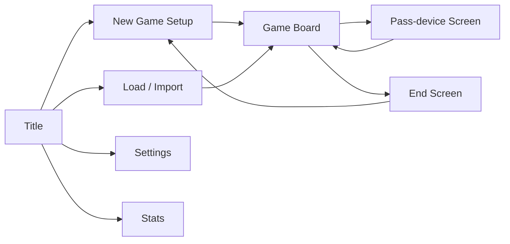

# 7. docs/UX_SPEC.md

## 7.1 Screen map

| Screen | Required elements |
| --- | --- |
| Title | Continue (if autosave), New Game, Load, Settings, Stats, How to Play, version + seed display |
| New Game Setup | GDD 4.1 fields; presets (Quick: goals 30, Standard: 50, Marathon: 80); Start disabled until valid |
| Game Board | Ring board center; HUD; location panel; event log drawer; menu (save, load, settings, quit) |
| Pass-device | Hotseat only, shown before each human turn when >1 human: "Pass to \<name>" + Ready button; hides previous player's private info |
| End | GDD 4.16 |
| Settings | Music/SFX volume + mute, reduced motion, text scale 100/125/150%, theme, AI speed, Classic opacity default, language (EN only), reset data |
| Stats | Games played, wins by ruleset, fastest win (weeks), highest net worth |

## 7.2 Game board layout

- **Desktop/tablet (≥ 768px):** board SVG left/center (max square), right column 360px: HUD top, location panel below. Event log bottom drawer.
- **Phone (< 768px):** top compact HUD bar (week, hours ring, cash, 4 goal mini-bars, wellbeing); middle mini-ring (tap to expand full-screen board) + scrollable location list sorted by travel time; actions in bottom sheet.
- Travel: tap/click location → travel sheet with mode options (hours, cost, availability reason) → confirm → token animates → location panel opens.

## 7.3 HUD

- Always visible: active player name/color, week, hours left (ring + number), cash, bank, 4 goal bars showing current/target with checkmark when met, wellbeing bar with band label [modern], weekly subscription total [modern], loan payment due [modern].
- Standings button → panel: all players' goal progress % and total %.
- Classic opacity ON: goal bars show only filled/unfilled at 25% steps; hidden stats never shown; previews show hours and money only.

## 7.4 Location panel and action preview

- Header: location name, quip, open/closed state.
- Action list from `legalCommands` + disabled actions with reason (i18n from `ErrorCode`).
- Every time-consuming or money-moving action shows a preview line before confirm: `−6h · +$96 · Dependability +2 · Wellbeing −3`. Risky actions show risk % (e.g. "Scam risk 4%").
- Confirm via button or Enter; repeated actions (work, study) support a "repeat until hours run out" toggle that stops on any event.

## 7.5 Events and log

- Start-of-turn events shown as modal cards (title, satirical text, effect chips), dismissed with Enter/click; max 3 stacked.
- Event log drawer: per-week grouped entries for all players (private amounts hidden for other humans in hotseat unless Classic opacity off and settings allow).
- AI turn: compact ticker of AI actions with skip button; speed per setting.

## 7.6 Tutorial (skippable, replayable from menu)

Scripted, triggered on first game or via How to Play; runs in a fixed tutorial seed with 1 human + 1 Easy AI.

1. Welcome: goals and the 60-hour week.
2. Travel to JobLink Center; explains hours per step and transport modes.
3. Apply for entry job (guaranteed); explains requirements.
4. Travel to workplace; work one shift; explains pay, dependability, experience.
5. Buy a meal; explains starvation.
6. Visit university; enroll; explains degrees.
7. Go home; relax; explains happiness and wellbeing.
8. End turn; explains rent every 4 weeks and events.
9. Week 2: bank deposit and one investment preview; street theft warning.
10. Done: tooltip tour of HUD; tutorial ends, normal play continues.

Each step highlights one UI element (spotlight), blocks unrelated input, and advances on the matching `DomainEvent`. Skip at any time.

## 7.7 Keyboard map

| Key | Action |
| --- | --- |
| 1–9, 0, Q, W, E, R, T, Y | Travel to location by ring index (shown as badge) |
| Enter / Space | Confirm / primary action |
| Esc | Back / close |
| Tab / Shift+Tab | Focus navigation |
| M | Cycle transport mode in travel sheet |
| L | Toggle event log |
| G | Standings |
| H | Help overlay |
| Ctrl/Cmd+S | Manual save |
| Shift+E | End turn (with confirm if hours > 6) |

## 7.8 Accessibility (WCAG 2.2 AA)

- All interactive elements are native buttons/links or have ARIA roles; board SVG locations are focusable with `aria-label` including name, distance and hours.
- Live region announces: hours left changes, money changes, events, turn changes.
- Contrast ≥ 4.5:1 text, ≥ 3:1 UI components in both themes; focus ring ≥ 2px visible.
- Target size ≥ 24×24 CSS px (44×44 on touch layouts).
- `prefers-reduced-motion` and setting disable token path animation (instant move) and modal transitions.
- No information conveyed by color alone (shape + initial on tokens, icons + text on status).
- Playwright runs axe on Title, Setup, Board (desktop + phone), Event modal, End screen; 0 serious/critical violations required.

## 7.9 Debug switches (dev + e2e only, `?debug=1`)

Autoplay all seats with AI, set seed, jump to week, grant money, show hidden stats, export state hash. Stripped from production unless `?debug=1` and build flag `VITE_DEBUG_ALLOWED=true` (true in e2e build, false in deploy).
